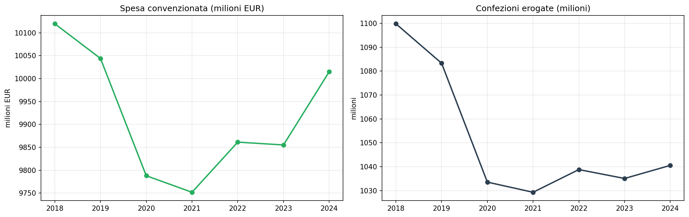
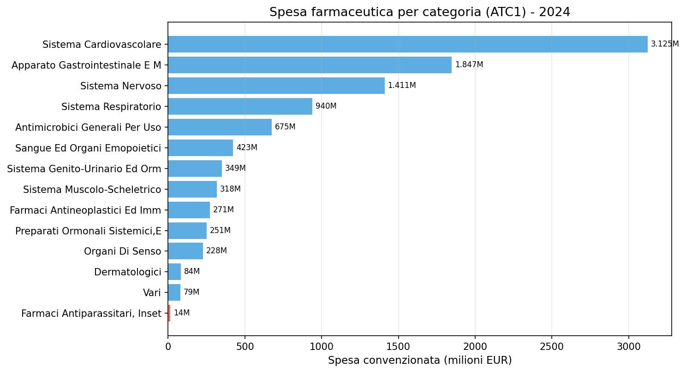
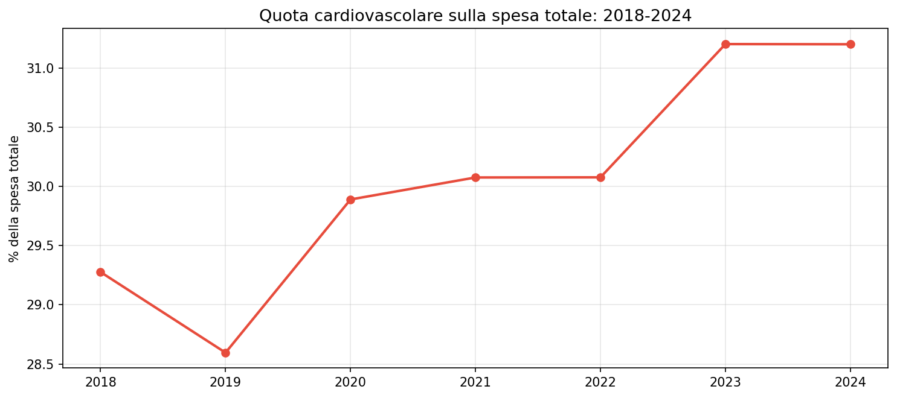

# AIFA Spesa farmaceutica 2018-2024 — il cardiovascolare domina, la spesa totale si contrae

**La spesa farmaceutica convenzionata si è leggermente contratta (-1%) in 7 anni, ma la quota del cardiovascolare è salita dal 29,3% al 31,2%. Tre categorie (cuore, stomaco, nervi) assorbono il 64% della spesa.**

Nel 2024 il Servizio Sanitario Nazionale ha speso circa **10 miliardi di euro** per la farmaceutica convenzionata (classe A), erogando poco più di 1 miliardo di confezioni. La spesa è sostanzialmente stabile dal 2018, con una flessione leggera (-1%) compensata dall'aumento del peso delle patologie croniche.

> Spesa 2024: **10,0 miliardi di euro** (classe A).
> Confezioni erogate: **1.041 milioni**.
> Cardiovascolare: **31,2%** della spesa (era 29,3% nel 2018).

---

## 1. Trend nazionale 2018-2024

La spesa totale è calata lievemente, da 10,12 a 10,02 miliardi. Le confezioni sono diminuite da 1,08 a 1,04 miliardi, segnalando una compressione dei volumi più marcata della spesa.

| Anno | Spesa (milioni EUR) | Confezioni (milioni) |
|------|-------------------|---------------------|
| 2018 | 10.120 | 1.100 |
| 2019 | 10.044 | 1.083 |
| 2020 | 9.788 | 1.034 |
| 2021 | 9.752 | 1.029 |
| 2022 | 9.861 | 1.039 |
| 2023 | 9.855 | 1.035 |
| 2024 | 10.015 | 1.041 |

## 2. Dove vanno i soldi — categorie terapeutiche

Tre categorie ATC assorbono quasi due terzi della spesa totale.

| Categoria | Spesa 2024 (milioni) | Quota % |
|-----------|-------------------|---------|
| Sistema cardiovascolare | 3.125 | 31,2% |
| Apparato gastrointestinale e metabolismo | 1.847 | 18,4% |
| Sistema nervoso | 1.411 | 14,1% |
| Sistema respiratorio | 940 | 9,4% |
| Antimicrobici generali | 675 | 6,7% |
| Sangue ed organi emopoietici | 423 | 4,2% |
| Altre categorie | 1.594 | 15,9% |

La quota del cardiovascolare è in crescita costante: era il 29,3% nel 2018, è salita al 31,2% nel 2024. Una tendenza che riflette l'invecchiamento della popolazione e la cronicità delle patologie cardiovascolari.

## 3. La geografia della spesa

La spesa farmaceutica segue la distribuzione demografica, ma con alcune anomalie. Lombardia, Campania e Lazio da sole fanno il 40% del totale.

| Regione | Spesa 2024 (milioni) | Quota % |
|---------|-------------------|---------|
| Lombardia | 1.889 | 18,9% |
| Campania | 1.052 | 10,5% |
| Lazio | 1.034 | 10,3% |
| Sicilia | 832 | 8,3% |
| Puglia | 730 | 7,3% |
| Veneto | 669 | 6,7% |
| Piemonte | 633 | 6,3% |
| Emilia-Romagna | 609 | 6,1% |
| Toscana | 527 | 5,3% |
| Calabria | 359 | 3,6% |
| Altre regioni | 1.681 | 16,8% |

---

## Cosa abbiamo imparato

### I fatti

1. **La spesa farmaceutica convenzionata è stabile** intorno ai 10 miliardi annui, con una lieve contrazione (-1%) in 7 anni.
2. **Il cardiovascolare domina** con il 31,2% della spesa, in crescita rispetto al 29,3% del 2018.
3. **Tre categorie (cardiovascolare, gastrointestinale, nervoso) fanno il 64%** della spesa totale.
4. **Lombardia, Campania e Lazio concentrano il 40%** della spesa nazionale.
5. **La quota cardiovascolare cresce** anno dopo anno, sintomo dell'invecchiamento della popolazione.

### E allora?

La spesa farmaceutica convenzionata è sostanzialmente stabile, ma la sua composizione si sta spostando verso le patologie croniche. Il cardiovascolare guadagna terreno, mentre calano gli antimicrobici e i farmaci per l'apparato respiratorio. La domanda è: **questa stabilizzazione della spesa reggerà con l'invecchiamento della popolazione, o è il preludio a una nuova fase di crescita?**

---

## Dataset

- **Fonte**: AIFA — Open Data Spesa e Consumo Farmaceutico
- **Copertura temporale**: 2018-2024 (7 anni)
- **Copertura**: nazionale, regionale, per classe terapeutica ATC
- **Dataset in clean-query**: `aifa_spesa_consumo`

### Limiti

- Solo farmaceutica **convenzionata** (classe A), non include la distribuzione diretta e l'ospedaliera
- I dati per categoria ATC1 sono aggregati — alcune sottocategorie specifiche potrebbero avere dinamiche diverse
- La classificazione regionale è per sede di erogazione, non per residenza del paziente

---

## Notebook

- `notebooks/aifa_spesa_v2.ipynb` — validazione dati, genera figure in `figures/`

## Contratto tecnico

[candidates/aifa-spesa-consumo](https://github.com/dataciviclab/dataset-incubator/tree/main/candidates/aifa-spesa-consumo)
