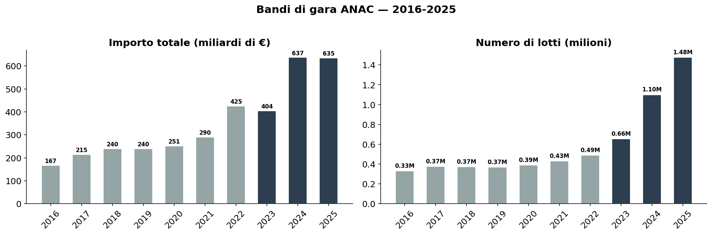
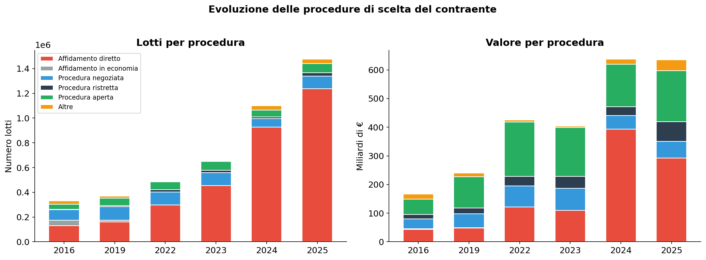
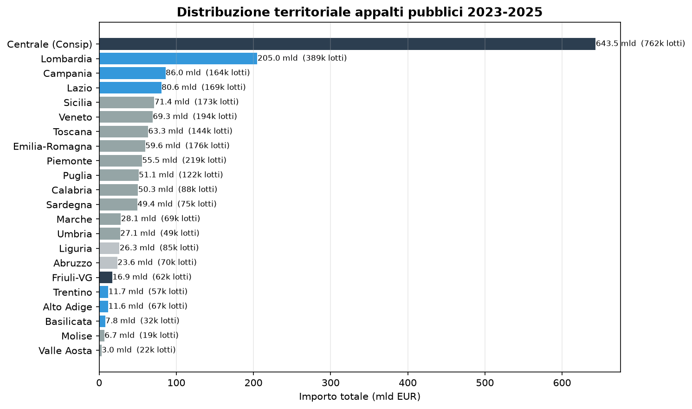
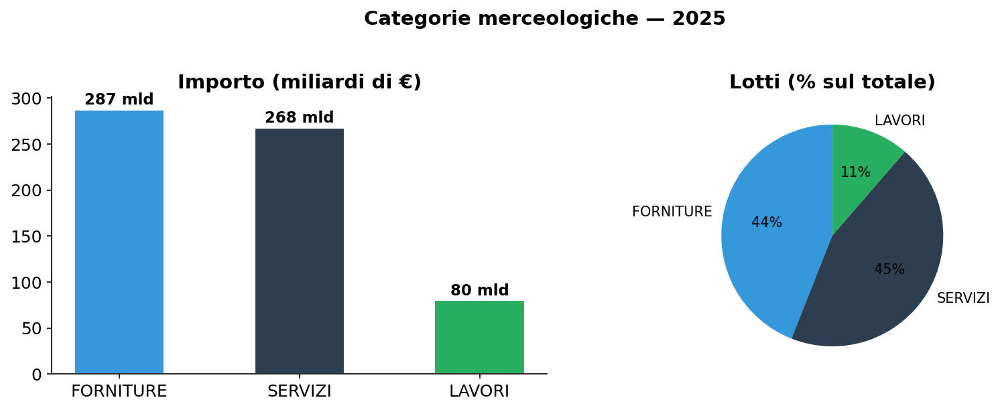

# 10 anni di appalti pubblici: da 167 a 635 miliardi in un decennio

**In 10 anni (2016-2025) la PA italiana ha pubblicato quasi 6 milioni di lotti di gara per un valore complessivo di 3.504 miliardi di euro. I lotti sono passati da 332.000 a 1,48 milioni all'anno (+4,4x), trainati dall'esplosione degli affidamenti diretti dopo il nuovo Codice Appalti del 2023.**

> **5,99 milioni** di lotti · **3.504 miliardi di €** · **2016-2025** · **+4,4x lotti in 10 anni**

---

## 1. Il trend decennale: una crescita esponenziale

Dal 2016 al 2025 il numero di lotti pubblicati è cresciuto costantemente, con un'accelerazione marcata dal 2023 in poi. Il valore totale segue lo stesso trend, passando da 167 a 635 miliardi annui.

| Anno | Lotti | Importo (mld €) | Importo medio (€) |
|------|-------|-----------------|-------------------|
| 2016 | 332.115 | 167 | 502.587 |
| 2017 | 374.234 | 215 | 574.106 |
| 2018 | 371.944 | 240 | 645.483 |
| 2019 | 369.654 | 240 | 648.914 |
| 2020 | 388.451 | 251 | 647.073 |
| 2021 | 431.227 | 290 | 672.175 |
| 2022 | 490.443 | 425 | 867.416 |
| 2023 | 655.125 | 404 | 616.948 |
| 2024 | 1.099.596 | 637 | 579.491 |
| 2025 | 1.475.581 | 635 | 430.166 |

Il 2022 segna un picco nell'importo medio (867.000 €), probabilmente legato a grandi appalti energetici e di materie prime. Dal 2023 il numero di lotti esplode (+125% in 2 anni) mentre l'importo medio si dimezza: è l'effetto del nuovo Codice Appalti, che ha alzato la soglia per l'affidamento diretto, moltiplicando le micro-gare.

---

## 2. L'affidamento diretto conquista il mercato

La fotografia è netta: **l'affidamento diretto è passato dal 39% dei lotti nel 2016 all'84% nel 2025**. Il nuovo Codice Appalti (D.Lgs. 36/2023, art. 50) ha alzato la soglia per l'affidamento diretto a 140.000 € per servizi e forniture e 150.000 € per lavori, producendo un effetto immediato.

| Anno | Affidamento diretto (% lotti) | Affidamento diretto (% valore) | Procedura aperta (% lotti) | Procedura aperta (% valore) |
|------|------------------------------|-------------------------------|---------------------------|----------------------------|
| 2016 | 39,5% | 25,6% | 12,0% | 31,5% |
| 2019 | 43,5% | 20,1% | 16,6% | 45,6% |
| 2022 | 60,8% | 28,6% | 13,0% | 44,6% |
| 2023 | 69,2% | 27,2% | 10,7% | 42,2% |
| 2024 | 84,3% | 61,8% | 5,0% | 23,3% |
| 2025 | **83,8%** | **46,0%** | 5,0% | 28,0% |

Il 2024 è l'anno di svolta: per la prima volta l'affidamento diretto supera in valore le procedure aperte (61,8% vs 23,3%), segnando un cambiamento strutturale nel modo in cui la PA spende.

---

## 3. Dove va la spesa — distribuzione territoriale

La **Sezione Centrale ANAC (Consip e centrali di committenza)** gestisce il 30% della spesa nel 2025. Seguono Lombardia (12%), Campania (7%) e Sicilia (7%). Un 9% di importi risulta non classificato per sezione regionale.

### Categorie merceologiche (2025)

| Categoria | Lotti | Importo (mld €) | Medio (k€) |
|-----------|-------|-----------------|------------|
| SERVIZI | 658.564 | 267,5 | 406 |
| FORNITURE | 649.450 | 287,1 | 442 |
| LAVORI | 167.566 | 80,2 | 478 |

Forniture e Servizi assorbono l'87% della spesa. I Lavori pubblici, pur con meno lotti, hanno gli importi medi più alti (478 k€).

---

## 4. Urgenza: un'etichetta quasi scontata

Nel 2025 il **68% dei lotti** ha il flag urgenza attivo, per un valore di 287 miliardi di euro. Questo dato va letto con cautela: nella maggior parte dei casi la motivazione è "NON APPLICABILE", segnalando che il flag è spesso compilato come default amministrativo più che come indicatore di reale urgenza.

L'urgenza era marginale nel 2016 (1,4% dei lotti) ed è diventata prevalente dal 2024, suggerendo un cambiamento nella compilazione della scheda bando più che un'impennata di reali necessità urgenti.

---

## Cosa abbiamo imparato

### I fatti

1. **I lotti di gara sono quasi 6 milioni in 10 anni** e sono quadruplicati: da 332.000 (2016) a 1,48 milioni (2025).
2. **L'affidamento diretto è la nuova normalità**: ha superato l'84% dei lotti nel 2024-2025 dopo il nuovo Codice Appalti.
3. **La PA centrale gestisce il 30% della spesa totale**: il resto è frammentato tra regioni, con Lombardia (12%), Campania (7%) e Sicilia (7%) ai primi posti.
4. **Il valore medio per lotto si è dimezzato**: da 867.000 € (2022) a 430.000 € (2025), segno di una frammentazione della spesa in tante micro-gare.
5. **Il flag urgenza è ormai compilato nel 68% dei casi** (287 mld), ma spesso senza reale motivazione: è più un'abitudine amministrativa che un indicatore affidabile.

### E allora?

Il nuovo Codice Appalti ha semplificato le procedure, ma ha anche prodotto un effetto collaterale: la moltiplicazione degli affidamenti diretti. È una semplificazione che riduce la concorrenza? E la qualità della spesa pubblica ne beneficia o ne risente?

---

## Dataset

- **Fonte**: ANAC — Autorità Nazionale Anticorruzione (Bandi di Gara CIG)
- **Copertura temporale**: 2016-2025 (10 anni)
- **Dataset in clean-query**: `anac_bandi_gara`
- **6,4 milioni di lotti**, 48 colonne

### Limiti

- I dati si riferiscono ai bandi pubblicati, non agli effettivi contratti stipulati
- Il flag urgenza è spesso compilato come "NON APPLICABILE", riducendone l'affidabilità
- La classificazione "sezione regionale" ANAC corrisponde alla sede ANAC competente, non alla localizzazione della stazione appaltante
- Importi outlier (es. contratti pluriennali multi-miliardari) sono reali ma vanno interpretati nel contesto

---

## Notebook

- `notebooks/appalti_procedure_spesa_v2.ipynb` — trend 2016-2025, figure in `figures/`
- `notebooks/appalti-procedure-spesa_v1.ipynb` — versione originale (2023-2025)

## Contratto tecnico

[candidates/anac-bandi-gara](https://github.com/dataciviclab/dataset-incubator/tree/main/candidates/anac-bandi-gara)
