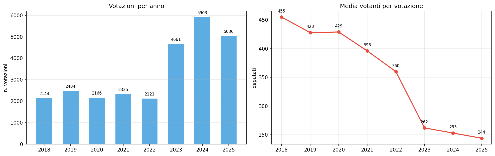

# Camera dei Deputati: votazioni 2018-2025 — si vota di più ma con meno deputati

**In 8 anni il numero di votazioni annuali è più che raddoppiato (+135%), mentre la media dei votanti per seduta è crollata del 46%. Nel 2025 votano in media 244 deputati per votazione, contro i 455 del 2018 — meno della metà dell'assemblea.**

Il 2023 ha segnato un punto di svolta: con l'inizio della XIX legislatura, le votazioni sono passate da circa 2.200 a oltre 4.600 annue. Nel 2024 hanno raggiunto il picco di 5.903 votazioni. Parallelamente, la partecipazione media è scesa sotto i 300 votanti per la prima volta nel 2023.

> Votazioni 2024: **5.903** (erano 2.144 nel 2018, +175%).
> Media votanti 2025: **244** (erano 455 nel 2018, -46%).
> Richieste di fiducia totali: **114** (2018-2025).
> Leggi approvate (votazione finale): **648**.

---

## 1. Più votazioni, meno partecipazione

Il trend è netto e in accelerazione: dal 2023 il numero di votazioni esplode mentre la partecipazione media collassa.

| Anno | Votazioni | Media votanti | Media favorevoli | Media contrari |
|------|----------|--------------|-----------------|---------------|
| 2018 | 2.144 | 455 | 198 | 257 |
| 2019 | 2.484 | 428 | 224 | 203 |
| 2020 | 2.166 | 429 | 228 | 201 |
| 2021 | 2.325 | 396 | 155 | 241 |
| 2022 | 2.121 | 360 | 148 | 212 |
| 2023 | 4.661 | 262 | 138 | 125 |
| 2024 | 5.903 | 253 | 130 | 123 |
| 2025 | 5.036 | 244 | 113 | 131 |

## 2. La fiducia come strumento

Le richieste di fiducia sono state 114 in 8 anni. Nel 2023 si è registrato il picco (26), anno di avvio della nuova legislatura e di formazione del governo.

| Anno | Votazioni totali | Con fiducia | % fiducia |
|------|-----------------|------------|-----------|
| 2018 | 2.144 | 6 | 0,3% |
| 2019 | 2.484 | 7 | 0,3% |
| 2020 | 2.166 | 17 | 0,8% |
| 2021 | 2.325 | 16 | 0,7% |
| 2022 | 2.121 | 10 | 0,5% |
| 2023 | 4.661 | 26 | 0,6% |
| 2024 | 5.903 | 17 | 0,3% |
| 2025 | 5.036 | 15 | 0,3% |

## 3. Votazioni finali: le leggi passano sempre

Le votazioni finali (approvazione di disegni di legge) sono 648 in 8 anni. La quasi totalità viene approvata: solo 2 non sono passate su 648 (entrambe nel 2019 e 2023). La media dei favorevoli è in calo anche per le leggi finali, seguendo il trend generale di partecipazione.

## 4. Votazione segreta

Le votazioni segrete sono una quota marginale del totale, ma mostrano un leggero aumento negli anni più recenti.

---

## Cosa abbiamo imparato

### I fatti

1. **Le votazioni sono più che raddoppiate** da 2.144 (2018) a 5.903 (2024).
2. **La partecipazione media è crollata del 46%**: da 455 a 244 votanti per votazione.
3. **Le richieste di fiducia sono 114** in 8 anni, con un picco di 26 nel 2023.
4. **Le leggi vengono quasi sempre approvate**: 646 su 648 votazioni finali hanno avuto esito positivo.
5. **Il 2023 segna lo spartiacque**: cambio di legislatura, votazioni triplicate, partecipazione sotto 300.

### E allora?

L'aumento delle votazioni e il calo dei votanti suggeriscono un uso più frequente del voto elettronico per frazionare le decisioni, con una partecipazione media che scende ben sotto la metà dei deputati. La domanda che resta: **questa è una maggiore efficienza o una minore qualità del confronto parlamentare?**

---

## Dataset

- **Fonte**: Camera dei Deputati — endpoint SPARQL dati.camera.it
- **Copertura temporale**: 2018-2025 (8 anni)
- **Copertura**: 26.840 votazioni della Camera
- **Metriche**: favorevoli, contrari, astenuti, presenti, votanti, approvato, fiducia, voto segreto
- **Dataset in clean-query**: `camera_votazioni_sparql`

### Limiti

- Solo Camera (mancano i dati del Senato)
- La partecipazione media è calcolata per votazione, non per seduta
- I dati non includono le dichiarazioni di voto o i dibattiti

---

## Notebook

- `notebooks/camera_votazioni_v2.ipynb` — validazione dati, genera figure in `figures/`

## Contratto tecnico

[candidates/camera-votazioni-sparql](https://github.com/dataciviclab/dataset-incubator/tree/main/candidates/camera-votazioni-sparql)
