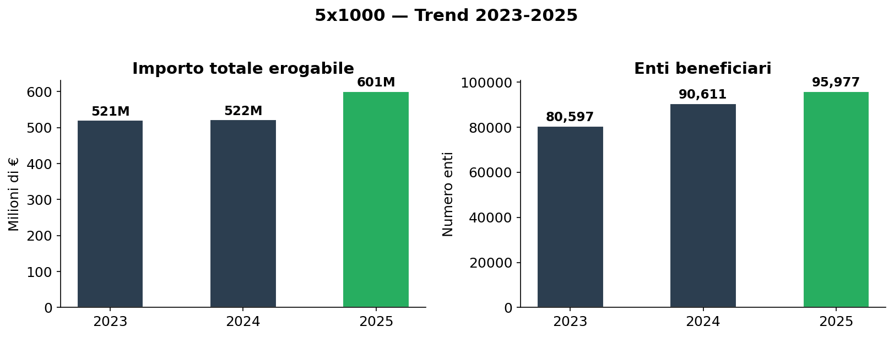
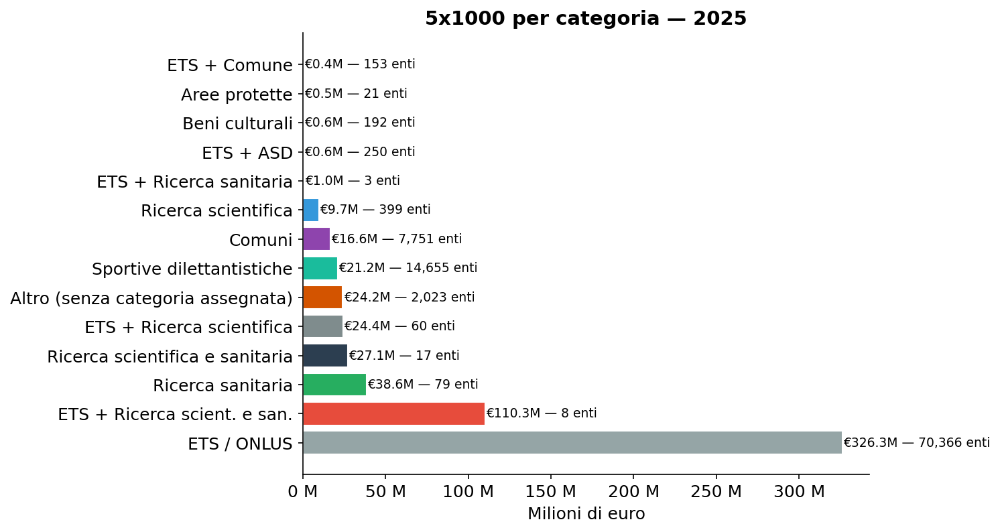
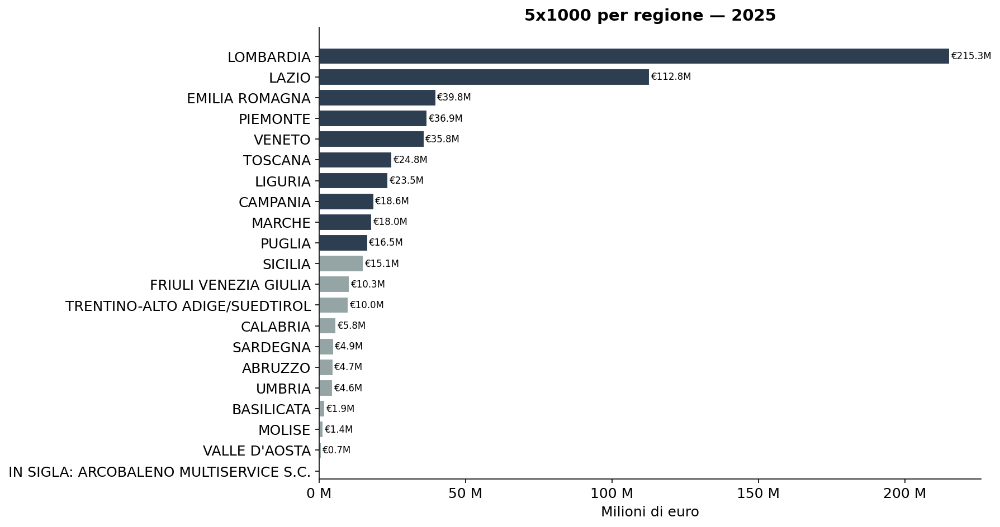
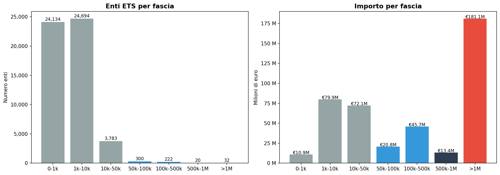
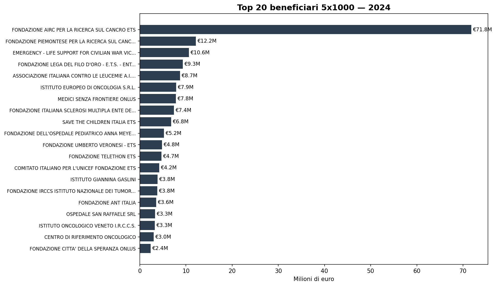

# 5x1000 — €601 milioni record nel 2025: dove vanno e chi li riceve

**Nel 2025, 95.977 enti hanno ricevuto €601 milioni dal 5x1000, da 15,5 milioni di scelte dei contribuenti. È il valore più alto mai registrato, in crescita del 15% rispetto al 2024. L'81% delle risorse va al Terzo Settore. Ma la distribuzione resta fortemente concentrata: Milano da sola assorbe il 30% del totale, e AIRC da sola prende l'82 milioni.**

Ogni anno i contribuenti italiani possono destinare il 5x1000 della propria IRPEF a enti del Terzo Settore, ricerca scientifica, ricerca sanitaria, comuni, associazioni sportive, beni culturali e aree protette. Con oltre €600 milioni e 15,5 milioni di scelte, è uno dei più grandi flussi di denaro pubblico al terzo settore italiano.

> **95.977 enti beneficiari (2025)** · **€601 milioni** · **15,5 milioni di scelte**  
> **+15% vs 2024** · **Top 10 enti:** 26% del totale

---

## 1. Trend 2023-2025: la crescita accelera

I dati 2023-2025 mostrano un'evoluzione netta: l'importo totale cresce del 15% tra 2024 e 2025, dopo due anni sostanzialmente stabili. Aumentano sia il numero di enti beneficiari (+6%) sia le scelte dei contribuenti.

| Anno | Enti | Importo (€) | Scelte (mln) | Δ importo |
|------|------|------------|--------------|-----------|
| 2023 | 80.597 | 521 M | 14,4 | — |
| 2024 | 90.611 | 522 M | 15,1 | +0,2% |
| **2025** | **95.977** | **601 M** | **15,5** | **+15%** |

Il salto del 2025 è generalizzato: tutte le categorie crescono, ma la ricerca scientifica e sanitaria accelera più della media.

## 2. La distribuzione per categoria (2025)

Il 5x1000 si articola in categorie di beneficiari. La stragrande maggioranza delle risorse va agli enti del Terzo Settore (ETS e ONLUS): se si includono anche gli ETS che svolgono attività di ricerca, la quota sale all'81% del totale.

| Categoria | Enti | Importo | % su totale |
|-----------|------|---------|-------------|
| ETS / ONLUS | 70.366 | €326,3 milioni | 54,3% |
| ETS + Ricerca scient. e san. | 8 | €110,3 milioni | 18,3% |
| Ricerca sanitaria | 79 | €38,6 milioni | 6,4% |
| Ricerca scientifica e sanitaria | 17 | €27,1 milioni | 4,5% |
| ETS + Ricerca scientifica | 60 | €24,4 milioni | 4,1% |
| Sportive dilettantistiche | 14.655 | €21,2 milioni | 3,5% |
| Comuni | 7.751 | €16,6 milioni | 2,8% |
| Ricerca scientifica | 399 | €9,7 milioni | 1,6% |
| Senza categoria assegnata | 2.023 | €24,2 milioni | 4,0% |
| ETS + Ricerca sanitaria | 3 | €1,0 milioni | 0,2% |
| ETS + ASD | 250 | €0,6 milioni | 0,1% |
| Beni culturali | 192 | €0,6 milioni | 0,1% |
| Aree protette | 21 | €0,5 milioni | 0,1% |
| ETS + Comune | 153 | €0,4 milioni | 0,1% |

*Gli enti sono classificati in base ai flag dichiarati nell'elenco dell'Agenzia delle Entrate. AIRC (€82,7M) è ETS con attività di ricerca scientifica e sanitaria e compare nella riga "ETS + Ricerca scient. e san.". La riga "Senza categoria assegnata" raccoglie 2.023 enti per cui nessun flag risulta attivo — probabilmente dati incompleti o residue da anni precedenti.*

## 3. La geografia del 5x1000

La distribuzione territoriale è fortemente polarizzata. Lombardia e Lazio da sole assorbono oltre la metà del totale nazionale.

| Regione | Enti | Importo | % nazionale |
|---------|------|---------|-------------|
| Lombardia | 15.889 | €215,3 milioni | 35,8% |
| Lazio | 9.015 | €112,8 milioni | 18,8% |
| Emilia Romagna | 8.242 | €39,8 milioni | 6,6% |
| Piemonte | 8.426 | €36,9 milioni | 6,1% |
| Veneto | 8.103 | €35,8 milioni | 6,0% |
| Toscana | 6.090 | €24,8 milioni | 4,1% |
| Liguria | 2.404 | €23,5 milioni | 3,9% |
| Campania | 6.015 | €18,6 milioni | 3,1% |
| Marche | 2.637 | €18,0 milioni | 3,0% |
| Puglia | 5.453 | €16,5 milioni | 2,7% |
| Sicilia | 5.986 | €15,1 milioni | 2,5% |
| Friuli V.G. | 2.618 | €10,3 milioni | 1,7% |
| Trentino AA | 3.555 | €10,0 milioni | 1,7% |
| Calabria | 3.046 | €5,8 milioni | 1,0% |
| Sardegna | 2.553 | €4,9 milioni | 0,8% |
| Umbria | 1.663 | €4,6 milioni | 0,8% |
| Abruzzo | 2.184 | €4,7 milioni | 0,8% |
| Basilicata | 1.062 | €1,9 milioni | 0,3% |
| Molise | 662 | €1,4 milioni | 0,2% |
| Valle d'Aosta | 373 | €0,7 milioni | 0,1% |

A livello provinciale, la concentrazione è ancora più estrema: la sola provincia di Milano (€175,1 milioni) vale più di tutto il Centro-Sud Italia messo insieme.

## 4. La piramide degli enti

La maggior parte degli enti del Terzo Settore riceve importi molto piccoli. Circa il 52% degli enti ETS con importo positivo prende meno di 10.000 euro. Circa 16.378 enti (il 19%) risultano con importo zero, probabilmente perché non hanno raggiunto la soglia minima per l'erogazione.

| Fascia | Enti (2025) | Importo totale | % sul totale ETS |
|--------|-------------|---------------|------------------|
| N/D (0 €) | 16.378 | €0 | 0% |
| 0 — 1.000 € | 24.535 | €11,1 milioni | 2,4% |
| 1.000 — 10.000 € | 24.856 | €80,8 milioni | 17,5% |
| 10.000 — 50.000 € | 4.019 | €76,9 milioni | 16,6% |
| 50.000 — 100.000 € | 342 | €23,1 milioni | 5,0% |
| 100.000 — 500.000 € | 246 | €48,9 milioni | 10,6% |
| 500.000 — 1M € | 29 | €19,1 milioni | 4,1% |
| Oltre 1M € | 32 | €201,9 milioni | 43,7% |

Il **43,7%** delle risorse va a 32 enti (0,03% degli ETS totali). In cima alla classifica troviamo grandi fondazioni e istituti di ricerca.

*Nota: la figura `fasce.png` si riferisce ai dati 2024 (strutturalmente simili). Il pattern di concentrazione è stabile tra gli anni.*

## 5. I top 10 beneficiari (2025)

| Ente | Regione | Scelte | Importo |
|------|---------|--------|---------|
| Fondazione AIRC per la ricerca sul cancro ETS | Lombardia | 1.802.357 | €82,7 milioni |
| Fondazione Piemontese per la Ricerca sul Cancro ETS | Piemonte | 286.934 | €14,3 milioni |
| EMERGENCY ONG ETS | Lombardia | 318.543 | €13,4 milioni |
| Fondazione Lega del Filo d'Oro ETS | Marche | 308.173 | €11,3 milioni |
| AIL — Assoc. Italiana contro le Leucemie ETS | Lazio | 264.635 | €10,2 milioni |
| Istituto Europeo di Oncologia S.r.l. | Lombardia | 144.582 | €9,5 milioni |
| Medici Senza Frontiere ONLUS | Lazio | 210.939 | €9,4 milioni |
| Fondazione Italiana Sclerosi Multipla ETS | Liguria | 182.438 | €8,6 milioni |
| Save the Children Italia ETS | Lazio | 181.359 | €7,9 milioni |
| Fondazione Ospedale Pediatrico Anna Meyer ETS | Toscana | 192.948 | €6,0 milioni |

La top 10 concentra da sola **€157 milioni** (26% del totale). AIRC domina con il 14% di tutto il 5x1000, in crescita rispetto ai €72M del 2024.

---

## Cosa abbiamo imparato

### I fatti

1. **€601 milioni** nel 2025, record assoluto (+15% in un anno), erogati a 95.977 enti da 15,5 milioni di scelte.
2. **L'81% va al Terzo Settore** (ETS/ONLUS + ETS con ricerca), che rappresenta il 75% degli enti.
3. **Concentrazione geografica estrema**: Milano vale più di tutto il Centro-Sud.
4. **Concentrazione per ente**: 32 enti sopra 1M€ prendono il 43,7% delle risorse; AIRC da sola il 14%.
5. **Il 2025 segna un'accelerazione**: la crescita è trainata dalla ricerca (scientifica + sanitaria), che passa da 176 a 211 milioni (+20%).
6. **Base polverizzata**: oltre 49.000 enti ETS ricevono meno di 10.000 € ciascuno; 16.378 risultano con importo zero.
7. **I comuni** ricevono €17M — meno di un quarto di AIRC da sola.

### E allora?

Il 5x1000 è il più grande flusso di denaro pubblico verso il terzo settore, e nel 2025 ha raggiunto il record di 601 milioni. Ma la distribuzione è tutto tranne che equa: pochi enti nazionali assorbono la maggior parte delle risorse, mentre decine di migliaia di piccole realtà locali si dividono le briciole.

La domanda civica è: **questa concentrazione è efficiente o sta penalizzando il tessuto associativo diffuso che tiene insieme le comunità locali?**

---

## Dataset

- **Fonte**: Agenzia delle Entrate — Elenco beneficiari 5x1000
- **Copertura temporale**: 2023-2025 (tre anni disponibili nel formato clean)
- **Dataset in clean-query**: `ade_cinque_per_mille`

### Limiti

- La denominazione degli enti può avere refusi (es. caratteri `?` al posto di accenti)
- Un ente può comparire in più categorie (es. ETS + ricerca), rendendo non esclusiva la classificazione
- L'importo erogabile è quello calcolato dall'Agenzia, non necessariamente quello effettivamente erogato
- Non è possibile distinguere, all'interno degli ETS, tra associazioni, fondazioni, cooperative sociali e ODV senza incrociare il RUNTS

---

## Notebook

- `notebooks/cinque_per_mille_v3.ipynb` — trend 2023-2025, genera figure in `figures/`
- Eseguito con DuckDB su GCS pubblico (anonimo)

## Contratto tecnico

[candidates/ade-cinque-per-mille](https://github.com/dataciviclab/dataset-incubator/tree/main/candidates/ade-cinque-per-mille)
