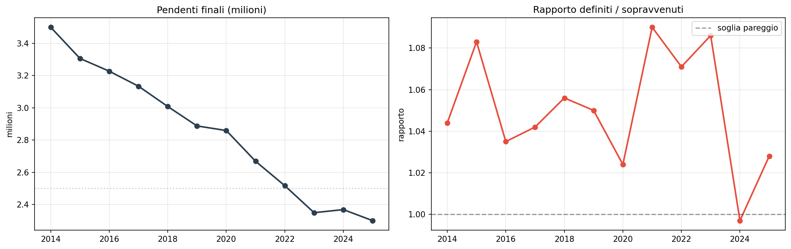
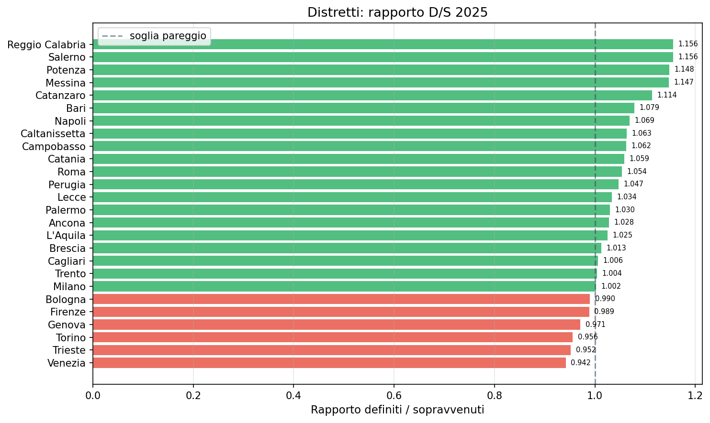

# Flussi giustizia civile 2014-2025 — il trend si inverte?

**Per la prima volta dal 2014, nel 2024 la giustizia civile ha definito meno cause di quante ne sono arrivate. Il rapporto D/S è sceso a 0,997. Il 2025 ha recuperato, ma il segnale è netto.**

Dal 2014 il backlog della giustizia civile è calato ininterrottamente, passando da 3,5 milioni di cause pendenti a 2,3 milioni (-34%). Un miglioramento costante che sembrava inarrestabile. Poi, nel 2024, qualcosa si è rotto: per la prima volta in 11 anni, i giudici hanno definito meno procedimenti di quanti ne sono stati avviati.

> Backlog 2014: **3.499.992** → 2025: **2.300.045** (-34%)  
> Rapporto D/S 2024: **0,997** (sotto la soglia di pareggio)  
> Distretti in sofferenza nel 2025: **6 su 26** (rapporto D/S < 1)

---

## 1. Il lungo declino del backlog (e il segnale del 2024)

Il calo delle cause pendenti è stato costante per 11 anni consecutivi. Ma il 2024 segna un'inversione di tendenza nel rapporto tra cause definite e sopravvenute.

| Anno | Sopravvenuti | Definiti | Pendenti | Rapporto D/S |
|------|-------------|---------|---------|-------------|
| 2014 | 2.728.755 | 2.849.226 | 3.499.992 | 1,044 |
| 2015 | 2.487.697 | 2.694.330 | 3.306.301 | 1,083 |
| 2020 | 1.997.290 | 2.045.655 | 2.859.048 | 1,024 |
| 2023 | 2.193.857 | 2.382.981 | 2.349.276 | 1,086 |
| **2024** | **2.334.664** | **2.328.275** | **2.368.444** | **0,997** |
| 2025 | 2.333.680 | 2.399.681 | 2.300.045 | 1,028 |

Il 2020 (COVID) aveva già compresso i sopravvenuti, ma il sistema aveva retto. Il 2024 è diverso: i sopravvenuti risalgono, i definiti non tengono il passo.

## 2. Chi soffre di più — i distretti nel 2025

Nel 2025, 6 distretti su 26 hanno ancora un rapporto D/S inferiore a 1, segno che non hanno recuperato dal 2024.

| Distretto | Rapporto D/S |
|-----------|-------------|
| Venezia | 0,942 |
| Trento | 0,965 |
| Brescia | 0,975 |
| Trieste | 0,990 |
| Bologna | 0,999 |
| Genova | 0,999 |
| **soglia pareggio** | **1,000** |
| Perugia | 1,001 |
| Reggio Calabria | 1,156 |

Il Nord-Est è l'area più in difficoltà: Venezia, Trento, Trieste e Bologna sono tutti sotto soglia. Reggio Calabria, al contrario, è il distretto più performante (1,156).

## 3. Il recupero del backlog — dove è stato più rapido

Quasi tutti i distretti (25 su 26) hanno ridotto il backlog dal 2014. L'unico in controtendenza è Sassari (+5,0%). I miglioramenti più netti:

| Distretto | Backlog 2014 | Backlog 2025 | Variazione |
|-----------|-------------|-------------|-----------|
| Bari | 247.328 | 111.855 | **-54,8%** |
| Napoli | 461.533 | 225.367 | -51,2% |
| Reggio Calabria | 127.696 | 63.116 | -50,6% |
| Salerno | 166.022 | 83.470 | -49,7% |
| Lecce | 131.453 | 68.960 | -47,5% |
| Potenza | 39.359 | 50.177 | +27,5% |

I distretti del Sud guidano la riduzione del backlog. Potenza è tra i pochi distretti con backlog in crescita insieme a Sassari (+5,0%), ma in valore assoluto resta contenuto.

---

## Cosa abbiamo imparato

### I fatti

1. **Il backlog si è ridotto del 34%** in 12 anni: da 3,5 a 2,3 milioni di cause pendenti.
2. **Il 2024 è stato un anno critico**: rapporto D/S sceso a 0,997, primo segnale di inversione dal 2014.
3. **Il 2025 ha recuperato** (1,028), ma 6 distretti restano sotto la soglia di pareggio.
4. **Il Nord-Est è l'area più in difficoltà**: Venezia, Trento, Trieste, Bologna sotto 1.
5. **Il Sud guida la riduzione del backlog**: Bari (-54,8%), Napoli (-51,2%), Reggio Calabria (-50,6%).

### E allora?

Dopo un decennio di miglioramento continuo, la giustizia civile mostra i primi segni di affanno. Il 2024 potrebbe essere stato un incidente di percorso o il segnale di un cambio di fase. I dati del 2025 dicono che il sistema ha retto, ma la domanda resta: **cosa serve per mantenere il rapporto D/S stabilmente sopra 1 in tutti i distretti?**

---

## Dataset

- **Fonte**: Ministero della Giustizia — DG Statistica
- **Copertura temporale**: 2014-2025 (12 anni)
- **Copertura**: 26 distretti, dati nazionali e per ufficio
- **Dataset in clean-query**: `civile_flussi`

### Limiti

- I dati aggregati per distretto non mostrano le differenze tra uffici giudiziari dello stesso distretto
- La classificazione delle materie è cambiata nel tempo (dal 2021 incorpora i flussi del tribunale delle imprese)
- Il dato 2025 è uno snapshot parziale (l'anno non è ancora concluso)

---

## Notebook

- `notebooks/civile_flussi_v2.ipynb` — validazione dati, genera figure in `figures/`

## Contratto tecnico

[candidates/civile-flussi](https://github.com/dataciviclab/dataset-incubator/tree/main/candidates/civile-flussi)
