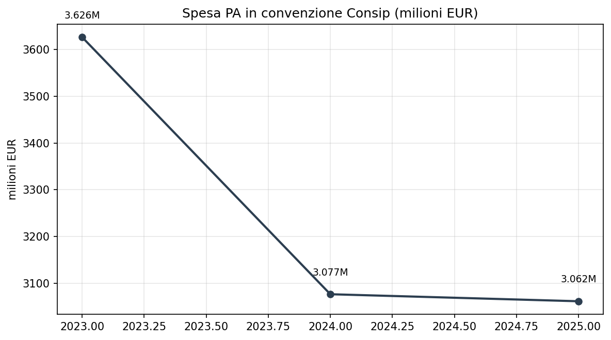
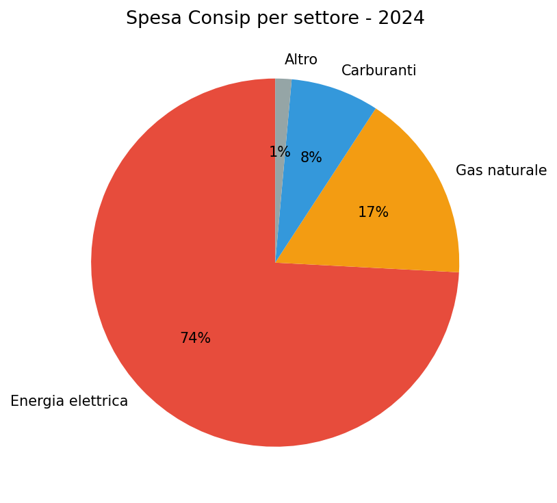
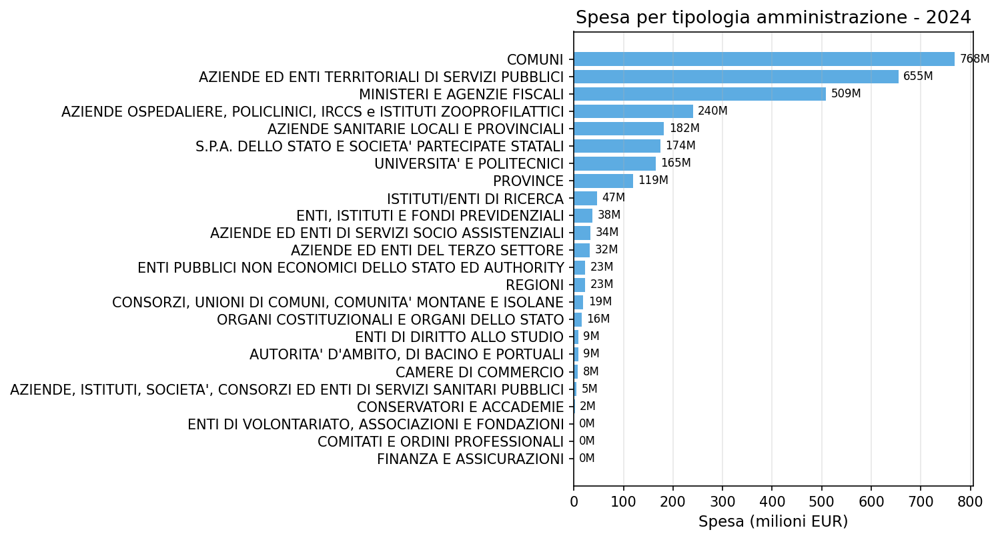

# Consip Consumi Convenzione 2023-2025 — l'energia domina la spesa delle PA

**La spesa della PA in convenzioni Consip è calata del 16% in tre anni, ma l'energia elettrica assorbe da sola il 74% del totale. Comuni e enti territoriali sono i principali acquirenti, Lazio e Lombardia le regioni che spendono di più.**

Nel 2024 le amministrazioni pubbliche italiane hanno speso circa **3,1 miliardi di euro** attraverso le convenzioni Consip. Il dato è in calo rispetto ai 3,6 miliardi del 2023 (-15%), mentre il calo cumulato 2023-2025 raggiunge il -16%. La composizione della spesa è fortemente concentrata: energia elettrica, gas e carburanti rappresentano il 98% del totale.

> Spesa 2024: **3.077 milioni di euro** (3,1 miliardi).
> Energia elettrica: **74%** della spesa totale.
> Comuni + enti territoriali: **46%** della spesa.
> Lazio + Lombardia: **38%** della spesa nazionale.

---

## 1. Trend 2023-2025

La spesa è in calo costante: -564 milioni (-16%) tra 2023 e 2025. Il dato 2025 è parziale, ma la tendenza al ribasso è netta.

| Anno | Spesa (milioni EUR) |
|------|-------------------|
| 2023 | 3.626 |
| 2024 | 3.077 |
| 2025 | 3.062 |

## 2. Dove vanno i soldi — la composizione per settore

La spesa è quasi interamente energetica. Energia elettrica, gas e carburanti coprono il 98% del totale. Tutto il resto (altre convenzioni) vale appena il 2%.

| Settore | Spesa 2024 (milioni) | Quota % |
|---------|-------------------|---------|
| Energia elettrica | 2.282 | 74% |
| Gas naturale | 512 | 17% |
| Carburanti | 239 | 8% |
| Altro | 44 | 1% |

L'energia elettrica da sola vale quasi tre quarti della spesa totale in convenzione.
Il gas, nonostante il calo dei prezzi post-2022, resta il secondo capitolo di spesa.

## 3. Chi compra — tipologie di amministrazione

Comuni e aziende/enti territoriali sono i primi acquirenti, seguiti da Ministeri e Sanità.

| Tipologia amministrazione | Spesa 2024 (milioni) |
|--------------------------|-------------------|
| Comuni | 768 |
| Aziende ed enti territoriali servizi pubblici | 655 |
| Ministeri e agenzie fiscali | 509 |
| Aziende ospedaliere, policlinici, IRCCS | 240 |
| ASL | 182 |
| Società partecipate statali | 174 |
| Università e politecnici | 165 |
| Province | 119 |
| Altre tipologie | 265 |

Comuni e enti territoriali insieme valgono il 46% della spesa (1.423 milioni).
I Ministeri (principalmente sedi centrali a Roma) sono il terzo acquirente con 509 milioni.

## 4. La geografia della spesa

La distribuzione regionale riflette la presenza di amministrazioni centrali e la densità di enti locali.

| Regione | Spesa 2024 (milioni) | Quota % |
|---------|-------------------|---------|
| Lazio | 615 | 20% |
| Lombardia | 548 | 18% |
| Veneto | 258 | 8% |
| Sicilia | 248 | 8% |
| Campania | 206 | 7% |
| Puglia | 176 | 6% |
| Sardegna | 172 | 6% |
| Emilia Romagna | 147 | 5% |
| Piemonte | 134 | 4% |
| Altre regioni | 573 | 19% |

Lazio e Lombardia da sole fanno il 38% della spesa. Il Lazio è primo per la presenza delle amministrazioni centrali (Ministeri) a Roma. La Lombardia per la densità di enti locali e aziende sanitarie.

---

## Cosa abbiamo imparato

### I fatti

1. **La spesa in convenzione Consip è calata del 16%** tra 2023 e 2025, passando da 3,6 a 3,1 miliardi.
2. **L'energia elettrica domina con il 74%** della spesa totale, seguita dal gas (17%) e carburanti (8%).
3. **Comuni e enti territoriali fanno il 46%** della spesa, confermando il peso degli acquisti locali.
4. **Lazio e Lombardia concentrano il 38%** della spesa nazionale.
5. **Il calo della spesa riflette principalmente la riduzione dei prezzi energetici** post-2022 più che una contrazione dei volumi.

### E allora?

La spesa in convenzione Consip è dominata dall'energia. Questo significa che la sua evoluzione dipende più dai prezzi delle commodity che dalle scelte di efficienza della PA. La domanda che resta: **quanta di questa spesa potrebbe essere ridotta con misure di efficienza energetica, e quanta è semplicemente legata al prezzo del gas e dell'elettricità?**

---

## Dataset

- **Fonte**: Consip SpA / MEF — dati.consip.it
- **Copertura temporale**: 2023-2025 (3 anni)
- **Copertura**: nazionale, regionale, per tipologia amministrazione e convenzione
- **Dataset in clean-query**: `consip_consumi_convenzione`

### Limiti

- Il dato 2025 potrebbe essere parziale (anno in corso)
- Non include gli acquisti fuori convenzione (MEPA, gare autonome)
- La geografia si basa sulla sede della PA acquirente, non sul luogo di consumo effettivo
- Alcune convenzioni coprono più regioni (es. energia elettrica ha convenzioni nazionali)

---

## Notebook

- `notebooks/consip_spesa_v2.ipynb` — validazione dati, genera figure in `figures/`

## Contratto tecnico

[candidates/consip-consumi-convenzione](https://github.com/dataciviclab/dataset-incubator/tree/main/candidates/consip-consumi-convenzione)
