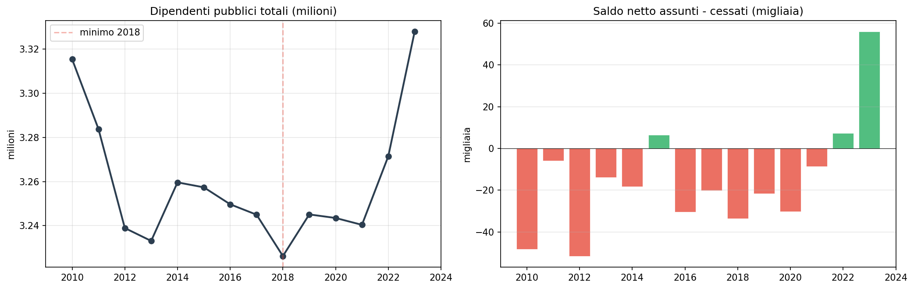
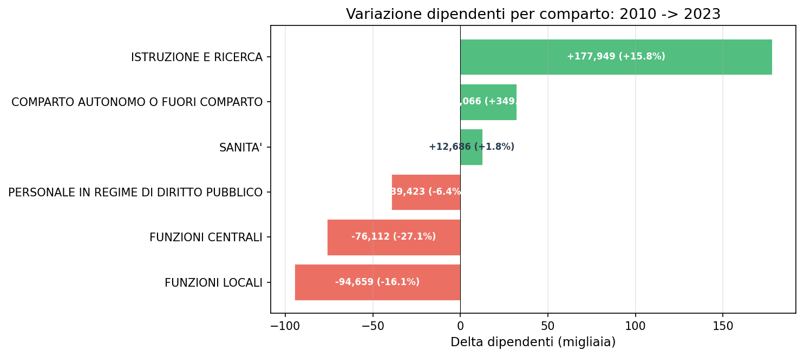
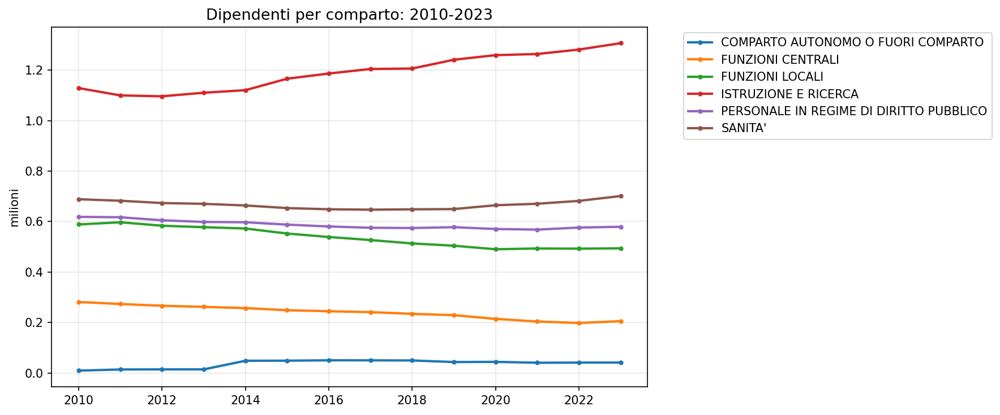
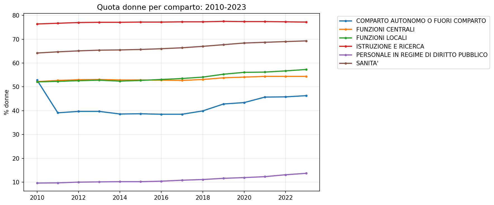

# Dipendenti pubblici 2010-2023 — il declino, la svolta, i conti in tasca

**La PA italiana ha smesso di rimpicciolirsi. Il 2023 segna il più grande saldo positivo di assunzioni in 14 anni. Ma chi ha guidato la ripresa? E chi è rimasto indietro?**

Dal 2010 al 2018 il pubblico impiego ha perso quasi 90.000 unità, un calo lento ma ininterrotto. Poi, tra 2021 e 2023, la macchina ha cambiato marcia: **248.000 assunzioni in un solo anno**, un record nella serie storica.

Ma la storia non è "la PA che assume". È più sottile. La crescita è concentrata in due soli comparti — Istruzione e Sanità — mentre il resto dell'amministrazione continua a perdere personale.

> Popolazione italiana 2023: **58.997.201**. Dipendenti pubblici: **3.327.854**.  
> **1 dipendente pubblico ogni 17 cittadini** (il 5,6% della popolazione).  
> Sanità: 1 ogni 84 cittadini. Istruzione: 1 ogni 45 cittadini.
>
> _Fonte popolazione: ISTAT — Popolazione residente al 1° gennaio (anno 2023)._

---

## 1. Il lungo declino — 2010-2018

Tra il 2010 e il 2018 il numero di dipendenti pubblici è calato stabilmente, anno dopo anno. Il minimo storico della serie si tocca nel 2018: **3.226.267** dipendenti, 89.000 in meno rispetto al 2010. Il blocco del turnover (2010-2014) e i tagli alla spesa pubblica hanno prodotto un assottigliamento lento ma costante.

> **Verdetto**: la PA si è ristretta per 8 anni consecutivi. La crescita è un fenomeno recente.

| Anno | Totale | Assunti | Cessati | Saldo netto |
|------|--------|---------|---------|------------|
| 2010 | 3.315.347 | 131.382 | 179.523 | -48.141 |
| 2012 | 3.238.949 | 86.722 | 138.251 | -51.529 |
| 2018 | **3.226.267** (minimo) | 142.793 | 176.390 | -33.597 |
| 2019 | 3.245.112 | 167.027 | 188.574 | -21.547 |
| 2021 | 3.240.397 | 197.844 | 206.422 | -8.578 |
| 2022 | 3.271.447 | 214.649 | 207.336 | +7.313 |
| **2023** | **3.327.854** | **248.606** | **192.640** | **+55.966** |

## 2. La svolta — 2019-2023

Dal 2019 la curva cambia direzione. Il 2023 è l'anno spartiacque:

- **248.606 assunti** — il valore più alto della serie, +26% sull'anno precedente
- **192.640 cessati** — in calo (-7%)
- **saldo netto +55.966** — in un anno solo si recuperano 56.000 dipendenti

Per capire la dimensione: nel 2023 sono state assunte più persone che in tutto il triennio 2012-2014 messo insieme (283.181).

> **Verdetto**: il 2023 è un'eccezione statistica nella serie 2010-2023, non una semplice tendenza.

## 3. Chi ha guidato la ripresa?

La crescita non è uniforme. Se scomponiamo per **comparto**, il quadro cambia radicalmente.

### Delta per comparto (2010→2023)

| Comparto | 2010 | 2023 | Delta | Var % |
|----------|------|------|-------|-------|
| ISTRUZIONE E RICERCA | 1.128.992 | **1.306.941** | **+177.949** | +15,8% |
| COMPARTO AUTONOMO | 9.184 | 41.250 | +32.066 | +349% |
| SANITA' | 688.484 | 701.170 | +12.686 | +1,8% |
| PERSONALE DIRITTO PUBBLICO | 618.745 | 579.322 | -39.423 | -6,4% |
| FUNZIONI CENTRALI | 281.316 | 205.204 | -76.112 | -27,1% |
| FUNZIONI LOCALI | 588.626 | 493.967 | -94.659 | -16,1% |

Istruzione e Sanità crescono (+190k). Funzioni Locali e Centrali calano (-171k). La crescita non è diffusa — è trainata quasi esclusivamente da Istruzione e Sanità.

### Saldo netto 2023 — i comparti che trainano

| Comparto | Assunti 2023 | Cessati 2023 | Saldo 2023 |
|----------|-------------|-------------|------------|
| SANITA' | 90.861 | 68.738 | **+22.123** |
| ISTRUZIONE E RICERCA | 59.639 | 38.802 | **+20.837** |
| FUNZIONI CENTRALI | 20.541 | 13.658 | +6.883 |
| PERSONALE DIRITTO PUBBLICO | 30.815 | 27.728 | +3.087 |
| FUNZIONI LOCALI | 44.533 | 41.458 | +3.075 |

Il saldo +56k del 2023 è concentrato per il **77% in Sanità e Istruzione**.

## 4. Chi c'è dentro la PA? — la composizione di genere

La PA italiana è **prevalentemente femminile**, ma con profonde differenze tra comparti.

| Comparto | Donne | Quota % |
|----------|-------|---------|
| ISTRUZIONE E RICERCA | 1.009.242 | **77,2%** |
| SANITA' | 486.121 | **69,3%** |
| FUNZIONI LOCALI | 282.856 | 57,3% |
| FUNZIONI CENTRALI | 111.732 | 54,4% |
| COMPARTO AUTONOMO | 19.083 | 46,3% |
| PERSONALE DIRITTO PUBBLICO | 79.564 | 13,7% |

La quota femminile è in lieve ma costante crescita in tutti i comparti dal 2010.

## 5. Part-time: un fenomeno stabile

A differenza di quanto si potrebbe pensare, il part-time nella PA non è esploso. Resta stabilmente intorno al 5-6%, senza grandi oscillazioni in 14 anni.

| Anno | Tempo pieno | Part-time | Quota PT % |
|------|------------|-----------|-----------|
| 2010 | 3.141.024 | 174.323 | 5,3% |
| 2020 | 3.053.043 | 190.456 | 5,9% |
| 2023 | **3.142.127** | 185.727 | 5,6% |

---

## Cosa abbiamo imparato

### I fatti

1. **Dal 2010 al 2018 la PA ha perso 89.000 dipendenti** — un calo lento ma costante, effetto del blocco del turnover e dei tagli.
2. **Dal 2019 la curva si inverte**, con un'accelerazione netta nel 2023: 248.000 assunti, saldo +56.000.
3. **La crescita non è uniforme**: Istruzione (+178.000) e Sanità (+12.700) fanno tutto il lavoro. Funzioni Locali (-94.700) e Centrali (-76.100) continuano a calare.
4. **Il 77% del saldo positivo 2023** è concentrato in Sanità e Istruzione.
5. **La PA è prevalentemente femminile** ma con divari enormi: si va dal 77% dell'Istruzione al 14% del Personale in Regime di Diritto Pubblico.
6. **Il part-time è stabile** al 5-6% — la flessibilità oraria non è un fenomeno in crescita.

### E allora?

La PA italiana sta cambiando forma sotto i nostri occhi. Il suo profilo si sta riorientando verso **servizi alla persona** (sanità, istruzione) a scapito di **funzioni amministrative e centrali**.

È il risultato di scelte politiche consapevoli? Dell'onda lunga del turnover bloccato per un decennio? O di entrambe?

Quel che è certo è che la fotografia del 2023 è molto diversa da quella del 2010. È la domanda che resta aperta e: **questa è la PA che vogliamo, o è solo quella che ci siamo trovati?**

---

## Dataset

- **Fonte**: MEF-BDAP — export CSV pubblico sui dipendenti pubblici per ente
- **Copertura temporale**: 2010-2023 (14 anni)
- **Copertura**: 572.278 righe, 6 comparti
- **Metriche**: totale dipendenti, assunti, cessati, genere (donne/uomini), orario (tempo pieno/part-time)
- **Dataset in clean-query**: `dipendenti_pubblici` — leggibile da `gs://dataciviclab-clean/dipendenti_pubblici/`

### Limiti

- **Nessuna geografia**: il dataset non contiene la regione, l'analisi è solo nazionale
- **Classificazione instabile**: il comparto "COMPARTO AUTONOMO O FUORI COMPARTO" mostra un salto netto nel 2014 (riclassificazione)
- **Nessun dettaglio per inquadramento**: non distinguiamo dirigenti da personale non dirigente

---

## Notebook

- `notebooks/dipendenti_pubblici_v2.ipynb` — analisi completa 2010-2023, eseguibile (legge dati live da GCS via DuckDB)
- `notebooks/dipendenti_pubblici_v1.ipynb` — versione precedente (solo 2021-2023)

---

## Contratto tecnico

Il contratto tecnico (dataset.yml, SQL, pipeline) vive in `dataset-incubator`:
[candidates/dipendenti-pubblici](https://github.com/dataciviclab/dataset-incubator/tree/main/candidates/dipendenti-pubblici)
