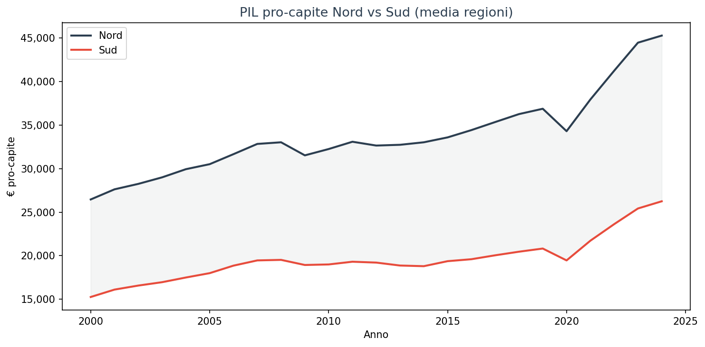
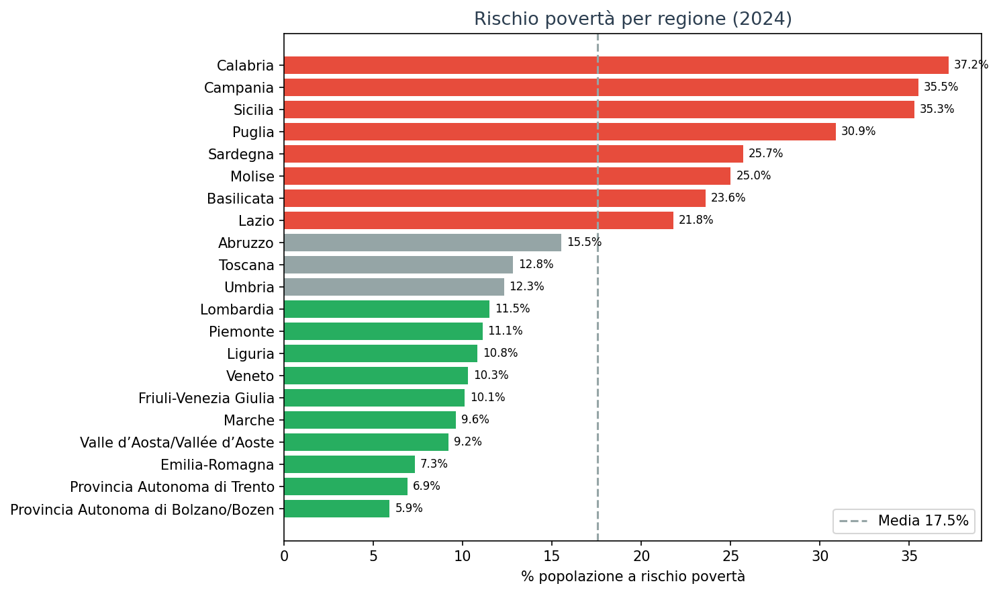
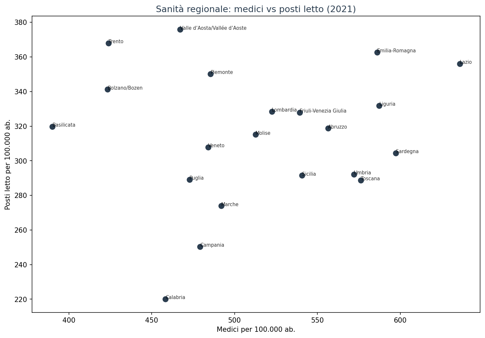
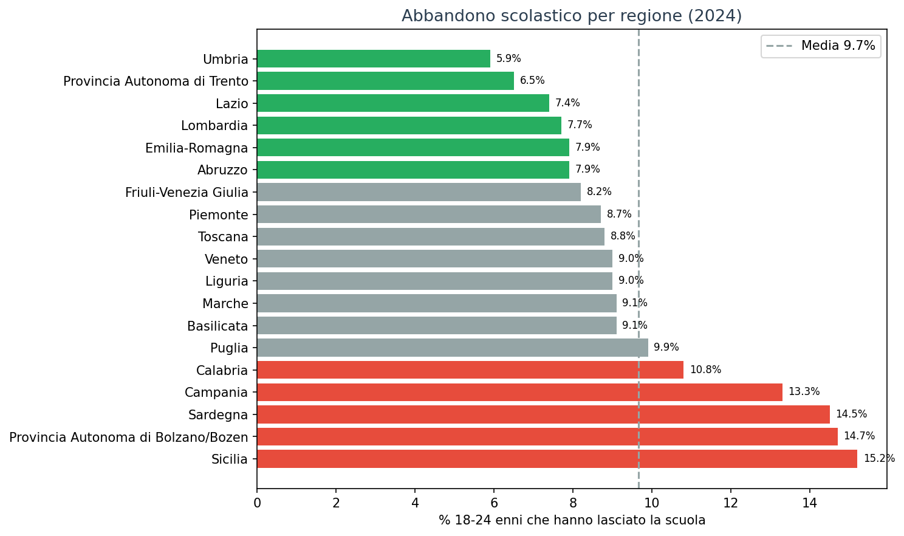
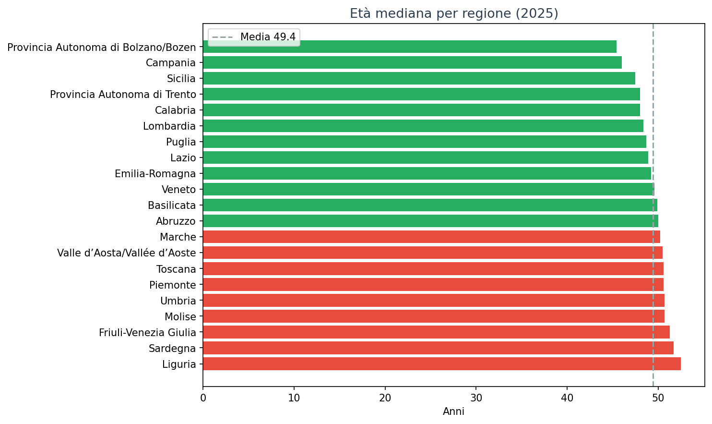

# Le due Italie — GDP, povertà, sanità, istruzione

Quanto è profondo il divario tra Nord e Sud Italia? La risposta dipende da cosa misurate.

Se guardate il PIL pro-capite, il gap è **1.6×** tra Bolzano e Calabria. Se guardate la povertà, sale a **6.3×**. Se guardate l'abbandono scolastico, il rapporto è **2.6×** — ogni dimensione ha una geografia diversa.

Questa analisi incrocia **5 dimensioni** — economia, povertà, sanità, istruzione e demografia — per dare una risposta multi-dimensionale.

> Le regioni italiane non sono divise solo dalla ricchezza, ma da un divario sistemico che attraversa sanità, istruzione e opportunità.

---

## 1. Economia: il PIL pro-capite

Il divario economico è il più noto, ma forse non il più grave.

| Regione | PIL pro-capite (2024) | % media EU |
|---|---|---|
| Bolzano | €61,540 | 178% |
| Lombardia | €50,400 | 146% |
| Emilia-Romagna | €44,500 | 129% |
| ... | ... | ... |
| Calabria | €21,800 | 63% |
| Campania | €24,600 | 71% |
| Sicilia | €23,400 | 68% |

Il Nord produce **2.8× più ricchezza pro-capite** del Sud. Ma la forbice si è allargata: da €11,200 di gap nel 2000 a €19,025 nel 2024.

## 2. Povertà: il divario che si allarga

Se il PIL misura la ricchezza prodotta, la povertà misura chi resta indietro.

| Regione | Rischio povertà (2024) |
|---|---|
| Calabria | **37.2%** |
| Campania | **35.5%** |
| Sicilia | **35.3%** |
| Bolzano | **5.9%** |
| Trento | **6.9%** |
| Emilia-Romagna | **7.3%** |

In Calabria, oltre **1 persona su 3** è a rischio povertà. In Alto Adige, **1 su 17**. Il rapporto è 6.3× — molto peggio del PIL.

## 3. Sanità: medici e posti letto

L'accesso alle cure è un'altra dimensione del divario.

| Regione | Medici/100k (2021) | Posti letto/100k (2021) |
|---|---|---|
| Lazio | 636 | 356 |
| Emilia-Romagna | 586 | 363 |
| Lombardia | 523 | 329 |
| Calabria | 458 | 220 |
| Campania | 479 | 250 |
| Basilicata | 390 | 320 |

Il dato è meno polarizzato: la Campania ha più medici pro-capite del Piemonte. Ma i **posti letto** raccontano un'altra storia: Calabria (220/100k) ha la metà di Emilia-Romagna (363).

## 4. Istruzione: abbandono scolastico

L'abbandono scolastico è forse il divario più grave — perché condiziona il futuro.

| Regione | Abbandono % (2024) |
|---|---|
| Sicilia | **15.2%** |
| Bolzano | **14.7%** |
| Sardegna | **14.5%** |
| Campania | 13.3% |
| ... | ... |
| Trento | 6.5% |
| Umbria | **5.9%** |

Il dato sorprendente: **Bolzano**, prima per PIL e ultima per povertà, è tra le peggiori per abbandono scolastico (14.7%). La ricchezza non si traduce automaticamente in istruzione.

## 5. Demografia: l'invecchiamento

Le regioni più povere sono anche quelle più giovani — un paradosso apparente.

| Regione | Età mediana (2025) | Indice dip. anziani |
|---|---|---|
| Liguria | 52.5 | 48.3 |
| Sardegna | 51.7 | 43.7 |
| Campania | 46.0 | 32.7 |
| Bolzano | 45.4 | 32.8 |

Il Sud è più giovane, ma non più ricco. La combinazione **giovani + poveri + meno sanità** è la vera trappola.

## Cosa abbiamo imparato

### I fatti

1. **Il divario economico (2.8×) è solo la punta dell'iceberg** — la povertà (6.3×) e l'abbandono scolastico raccontano un gap più profondo.
2. **Non esiste un solo divario** — ogni dimensione ha una geografia diversa. La sanità divide meno dell'istruzione.
3. **Il Sud è più giovane ma non ne beneficia** — avere popolazione giovane non basta se mancano opportunità economiche e servizi.
4. **Bolzano è un caso a sé** — prima per PIL, ultima per povertà, ma seconda peggiore per abbandono scolastico (14.7%). Un modello economico che non si traduce in istruzione.

### E allora?

Il divario Nord-Sud non è un problema solo economico. È un problema di **opportunità, salute, istruzione e futuro**. I fondi di coesione europei servono a ricucire questo strappo — ma dopo decenni di investimenti, il gap non si chiude. Perché?

---

## Dataset

- **GDP pro-capite**: `eurostat_gdp_nuts3` (clean-query) — Eurostat, NUTS2, 2000-2024
- **Rischio povertà**: `eurostat_poverty_risk_nuts2` — Eurostat ILC, NUTS2, 2003-2025
- **Medici**: `eurostat_physicians_nuts2` — Eurostat, NUTS2, 1993-2021
- **Posti letto**: `eurostat_hospital_beds_nuts2` — Eurostat, NUTS2, 1993-2024
- **Struttura popolazione**: `eurostat_pop_structure_nuts3` — Eurostat, NUTS2, 2014-2025
- **Abbandono scolastico**: `eurostat_early_school_leavers_nuts2` — Eurostat, NUTS2, 2000-2025
- **Copertura temporale**: 2000-2025 (variabile per dataset)

### Limiti

- I dati sanitari si fermano al 2021/2023 per alcune metriche
- La povertà è basata su survey EU-SILC (campionaria, non censuaria)
- L'analisi è a livello NUTS2 (regionale) — non cattura disuguaglianze intra-regionali

---

## Notebook

- `notebooks/divario-nord-sud_v2.ipynb` — validazione dati, genera figure in `figures/`

## Contratto tecnico

Analisi basata su dataset Eurostat del Lab pubblicati su GCS. Query eseguite via DuckDB su parquet puliti.
