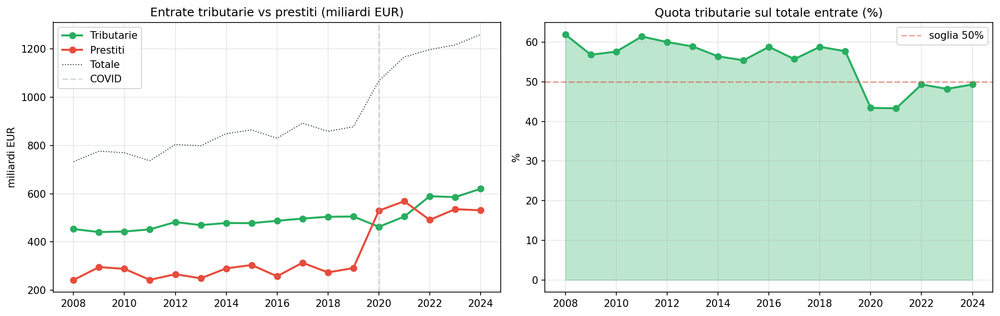

# Entrate dello Stato 2008-2024 — il peso dei prestiti raddoppia

**In 16 anni le entrate tributarie sono cresciute del 37%, ma i prestiti sono aumentati del 119%. Dal 2020, l'Italia si finanzia con debito quasi quanto con le tasse: la quota delle entrate tributarie sul totale è passata dal 61,9% al 49,3%.**

Prima del 2020, i prestiti oscillavano tra 240 e 300 miliardi annui. Dal 2020 in poi non scendono mai sotto i 490 miliardi. La media pre-COVID era di 277 miliardi, dopo il COVID è salita a 531 miliardi — quasi il doppio.

> Entrate tributarie 2024: **620 miliardi** (49,3% del totale).
> Prestiti 2024: **531 miliardi** (42,2% del totale).
> Media prestiti post-COVID: **531 miliardi** (era 277 miliardi, +92%).

---

## 1. Trend 2008-2024

| Anno | Tributarie | Prestiti | Totale | % Tributarie |
|------|-----------|---------|-------|-------------|
| 2008 | 453,6 | 242,7 | 732,4 | 61,9% |
| 2009 | 441,2 | 296,1 | 776,3 | 56,8% |
| 2010 | 443,4 | 288,9 | 769,4 | 57,6% |
| 2011 | 452,3 | 243,2 | 736,5 | 61,4% |
| 2012 | 482,5 | 266,7 | 803,5 | 60,0% |
| 2013 | 470,0 | 249,6 | 798,5 | 58,9% |
| 2014 | 478,5 | 290,7 | 848,6 | 56,4% |
| 2015 | 478,1 | 304,7 | 863,8 | 55,4% |
| 2016 | 487,8 | 258,1 | 829,7 | 58,8% |
| 2017 | 497,0 | 314,2 | 892,2 | 55,7% |
| 2018 | 504,5 | 274,0 | 858,4 | 58,8% |
| 2019 | 505,5 | 292,1 | 876,8 | 57,7% |
| 2020 | 462,9 | 529,8 | 1.067,2 | 43,4% |
| 2021 | 505,2 | 568,7 | 1.165,9 | 43,3% |
| 2022 | 589,6 | 491,4 | 1.196,6 | 49,3% |
| 2023 | 585,8 | 536,0 | 1.216,0 | 48,2% |
| 2024 | 620,2 | 531,2 | 1.259,0 | 49,3% |

## 2. Composizione 2024

Nel 2024 le entrate dello Stato sono composte per metà da entrate tributarie e per oltre il 40% da prestiti.

| Titolo | Miliardi EUR | Quota % |
|--------|-------------|---------|
| Entrate tributarie | 620 | 49,3% |
| Accensione di prestiti | 531 | 42,2% |
| Entrate extra-tributarie | 105 | 8,3% |
| Alienazioni e ammortamento beni | 3 | 0,2% |

## 3. Prima e dopo il COVID

Il dato più significativo è il salto strutturale dei prestiti dopo il 2020.

| Periodo | Media prestiti annui |
|---------|-------------------|
| Pre-COVID (2008-2019) | 277 miliardi |
| Post-COVID (2020-2024) | 531 miliardi |
| **Rapporto** | **x1,9** |

Prima del COVID, le entrate tributarie coprivano stabilmente oltre il 55% delle entrate totali, con punte del 62%. Dal 2020, la quota tributaria oscilla tra il 43% e il 49% — sotto la soglia psicologica del 50% per quattro anni su cinque.

---

## Cosa abbiamo imparato

### I fatti

1. **Le entrate tributarie sono cresciute del 37%** in 16 anni, passando da 454 a 620 miliardi.
2. **I prestiti sono più che raddoppiati** (+119%), da 243 a 531 miliardi.
3. **La quota delle entrate tributarie sul totale è scesa** dal 61,9% (2008) al 49,3% (2024).
4. **Dal 2020 lo Stato prende a prestito quasi il doppio** rispetto al periodo pre-COVID (531 vs 277 miliardi).
5. **Nel 2020 i prestiti hanno superato le tributarie** per la prima volta (530 vs 463 miliardi).

### E allora?

Il debito pubblico non è più solo una voce del passato: le accensioni di prestiti pesano stabilmente oltre il 40% delle entrate complessive dello Stato, contro il 30-35% del periodo pre-COVID. La domanda che resta: **questa è una fase transitoria o la nuova normalità della finanza pubblica italiana?**

---

## Dataset

- **Fonte**: MEF-BDAP
- **Copertura temporale**: 2008-2024 (17 anni)
- **Granularità**: per titolo, natura, tipologia, provento
- **Dataset in clean-query**: `bdap_entrate_stato`

### Limiti

- I dati sono su base **cassa** (previsioni definitive), non competenza
- La classificazione per titolo è cambiata nel tempo (riclassificazioni)
- I dati 2024 sono previsioni definitive, non consuntivo

---

## Notebook

- `notebooks/entrate_stato_v2.ipynb` — validazione dati, genera figure in `figures/`

## Contratto tecnico

[candidates/bdap-entrate-stato](https://github.com/dataciviclab/dataset-incubator/tree/main/candidates/bdap-entrate-stato)
