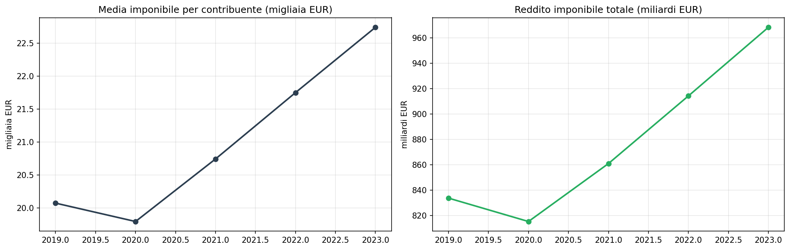
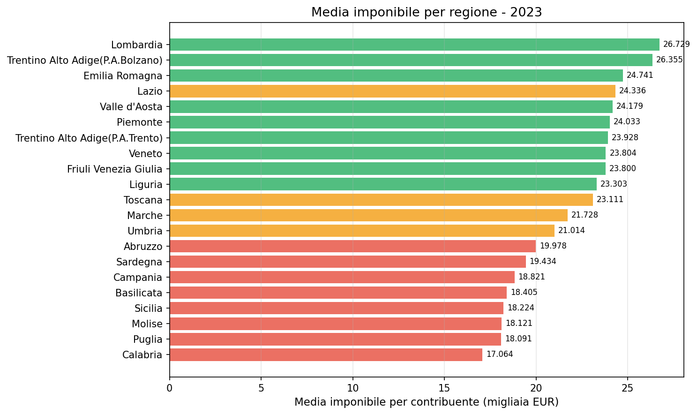
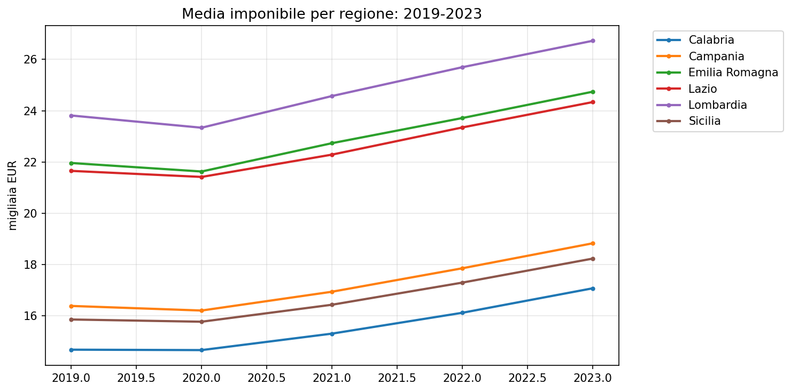

# IRPEF comunale 2019-2023 — il divario fiscale in Italia

**La media imponibile è cresciuta del 13% in 5 anni, ma il divario tra Nord e Sud resta ampio: un contribuente lombardo dichiara il 57% in più di uno calabrese.**

Nel 2023 i contribuenti italiani hanno dichiarato **968 miliardi di euro** di reddito imponibile, con una media di **22.743 euro a testa**. I numeri sono in crescita rispetto al 2019 (20.075 euro, +13%), ma la fotografia territoriale racconta un paese spaccato in due.

> Contribuenti 2023: **42,6 milioni**. Imponibile totale: **968 miliardi di euro**.  
> Media per contribuente: **22.743 euro**. Imposta netta: **190 miliardi**.

---

## 1. Il trend 2019-2023

Dopo il calo del 2020 (primo anno COVID), l'imponibile medio è risalito fino a toccare i 22.743 euro del 2023. In 5 anni la crescita è stata di 2.668 euro per contribuente (+13%).

| Anno | Contribuenti | Imponibile totale | Media imponibile | Imposta netta |
|------|-------------|-------------------|-----------------|--------------|
| 2019 | 41.525.982 | 833,6 miliardi | 20.075 € | 165,1 miliardi |
| 2020 | 41.180.529 | 815,2 miliardi | 19.796 € | 159,3 miliardi |
| 2021 | 41.497.318 | 860,9 miliardi | 20.745 € | 171,0 miliardi |
| 2022 | 42.026.960 | 914,2 miliardi | 21.752 € | 174,2 miliardi |
| 2023 | 42.570.078 | 968,2 miliardi | 22.743 € | 189,9 miliardi |

## 2. La geografia del reddito

### Regioni a confronto (2023)

| Regione | Media imponibile | Differenza vs media nazionale |
|---------|-----------------|------------------------------|
| Lombardia | 26.729 € | +18% |
| Trentino AA (Bolzano) | 26.355 € | +16% |
| Emilia Romagna | 24.741 € | +9% |
| Lazio | 24.336 € | +7% |
| Valle d'Aosta | 24.179 € | +6% |
| Piemonte | 24.033 € | +6% |
| Trentino AA (Trento) | 23.928 € | +5% |
| Veneto | 23.804 € | +5% |
| Friuli V.G. | 23.800 € | +5% |
| Liguria | 23.303 € | +2% |
| Toscana | 23.111 € | +2% |
| **--- media nazionale ---** | **22.743 €** | **---** |
| Marche | 21.728 € | -4% |
| Umbria | 21.014 € | -8% |
| Abruzzo | 19.978 € | -12% |
| Sardegna | 19.434 € | -15% |
| Campania | 18.821 € | -17% |
| Basilicata | 18.405 € | -19% |
| Sicilia | 18.224 € | -20% |
| Molise | 18.121 € | -20% |
| Puglia | 18.091 € | -20% |
| Calabria | 17.064 € | -25% |

Il divario tra la regione più ricca (Lombardia, 26.729 €) e la più povera (Calabria, 17.064 €) è del **57%**. La media del Nord (24.618 €) supera quella del Sud (18.517 €) del **33%**.

Il divario territoriale non si sta riducendo. Tutte le regioni crescono, ma la distanza tra Nord e Sud rimane sostanzialmente invariata.

## 3. Grandi città a confronto

Tra i comuni con oltre 200.000 contribuenti, la forbice è ancora più netta:

| Comune | Contribuenti | Media imponibile |
|--------|-------------|-----------------|
| Milano | 1.047.822 | 36.408 € |
| Bologna | 308.995 | 28.554 € |
| Roma | 1.982.316 | 28.204 € |
| Firenze | 283.661 | 27.206 € |
| Verona | 201.073 | 26.270 € |
| Torino | 641.387 | 26.148 € |
| Genova | 469.790 | 24.593 € |
| Bari | 218.565 | 23.340 € |
| Napoli | 505.838 | 21.940 € |
| Palermo | 367.930 | 21.740 € |

Milano registra una media imponibile di **36.408 euro per contribuente**, il 66% in più di Napoli (21.940 €).

## 4. La distribuzione del reddito

Nel 2023, oltre un terzo dei contribuenti italiani (36%) dichiara meno di 15.000 euro. Solo il 6% supera i 55.000 euro annui.

- **36%** dei contribuenti sotto i 15.000 €
- **30%** tra 15.000 e 26.000 €
- **27%** tra 26.000 e 55.000 €
- **6%** sopra i 55.000 €

---

## Cosa abbiamo imparato

### I fatti

1. **L'imponibile medio è cresciuto del 13%** tra 2019 e 2023, recuperando il calo del 2020.
2. **Il divario Nord-Sud è strutturale**: la Lombardia ha un imponibile medio del 57% superiore alla Calabria.
3. **La forbice non si riduce**: tutte le regioni crescono, ma la distanza relativa resta invariata.
4. **Milano vale quasi il doppio di Napoli** tra i grandi comuni.
5. **Oltre un terzo dei contribuenti** dichiara meno di 15.000 euro lordi all'anno.

### E allora?

Il sistema fiscale italiano si regge su una base imponibile concentrata geograficamente: poche regioni del Nord producono la maggior parte del gettito IRPEF. La perequazione e il fondo di solidarietà comunale esistono proprio per redistribuire queste risorse. Ma la domanda resta: **quanto divario è accettabile in un paese unitario?**

---

## Dataset

- **Fonte**: MEF — Open Data IRPEF comunale
- **Copertura temporale**: 2019-2023 (5 anni)
- **Copertura**: ~7.900 comuni, 21 regioni
- **Metriche**: contribuenti, reddito per tipologia, imponibile, imposta, scaglioni
- **Dataset in clean-query**: `irpef_comunale` — leggibile da GCS

### Limiti

- I dati sono per **comune di dichiarazione**, non per residenza effettiva
- Non include l'IRPEF degli omessi o dei non dichiaranti
- Le medie per contribuente non distinguono tra redditi da lavoro dipendente, autonomo e d'impresa

---

## Notebook

- `notebooks/irpef_comunale_v2.ipynb` — validazione dati, genera figure in `figures/`

## Contratto tecnico

[candidates/irpef-comunale](https://github.com/dataciviclab/dataset-incubator/tree/main/candidates/irpef-comunale)
