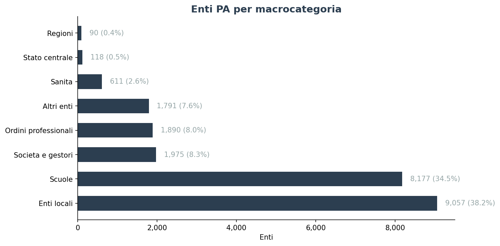
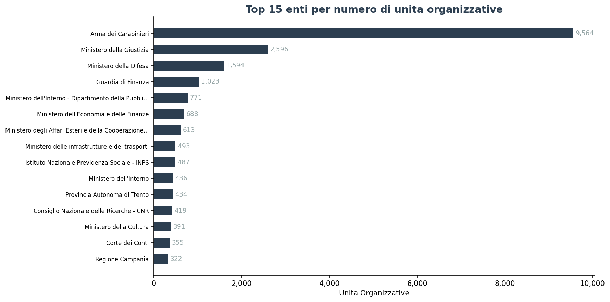
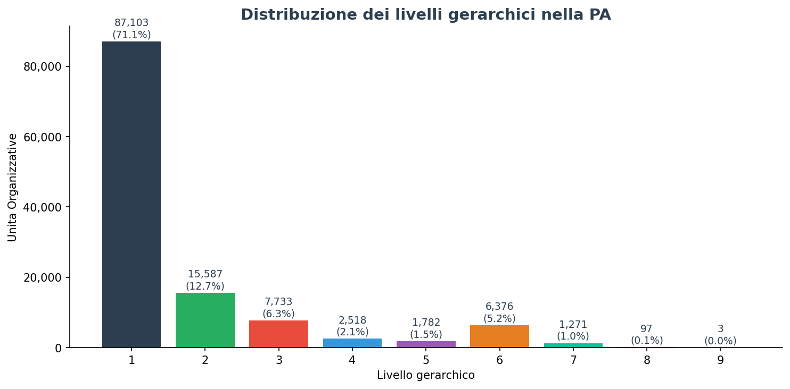
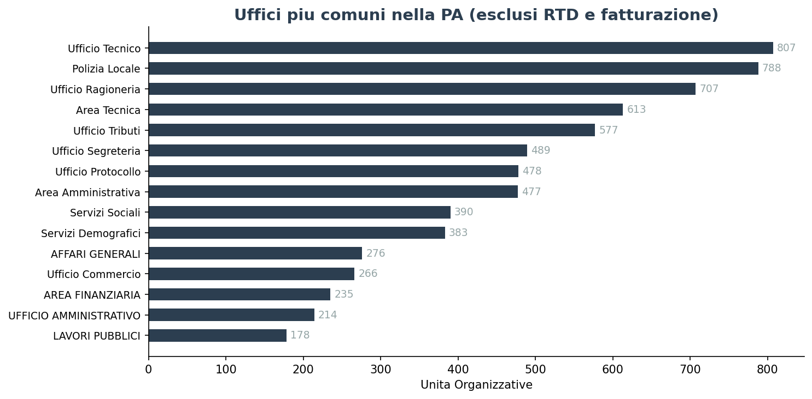
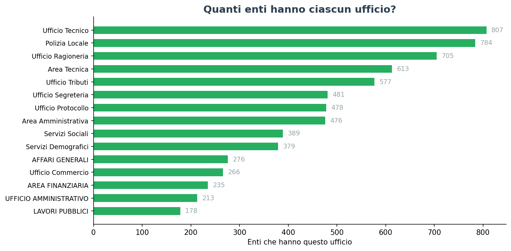
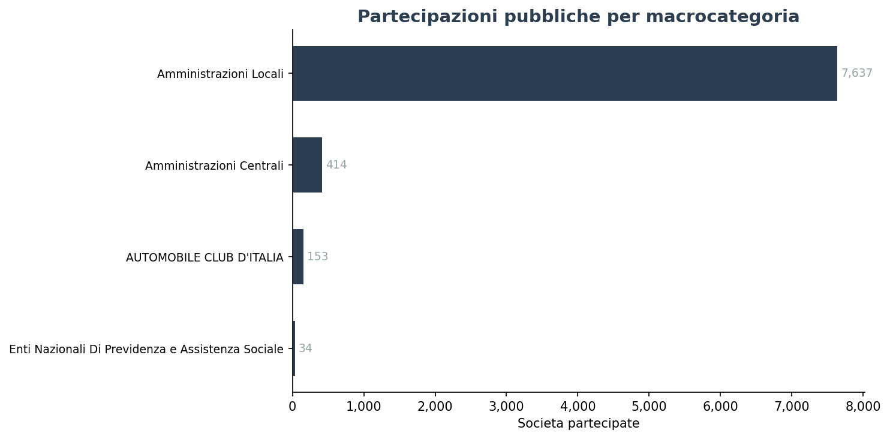
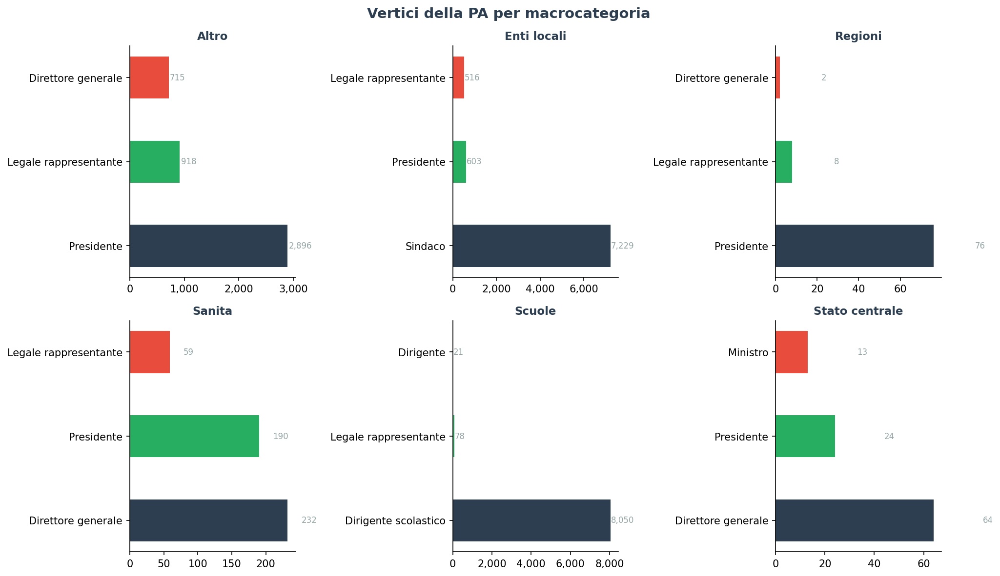

# La struttura della PA italiana

> **122.470 unità organizzative** in **23.530 enti**, distribuite su **9 livelli gerarchici**. I Carabinieri hanno più uffici di un intero ministero. Il 71% delle UO sono "radici" senza gerarchia dichiarata. Ecco la prima mappa completa della complessità organizzativa della Pubblica Amministrazione italiana.

---

## 1. La PA in numeri

La Pubblica Amministrazione italiana è un arcipelago di **23.709 enti** iscritti all'IndicePA. Di questi, **23.530** (99,2%) hanno almeno un'unità organizzativa censita. Il totale delle unità organizzative (UO) è **122.470**, raggruppate in **39.380 Aree Organizzative Omogenee (AOO)**.

Il 28,9% delle UO ha un legame gerarchico esplicito (campo `codice_uni_uo_padre` valorizzato), permettendo di ricostruire alberi organizzativi fino a **9 livelli di profondità**.

| Indicatore | Valore |
|---|---|
| Enti iscritti IPA | 23.709 |
| Enti con unità organizzative | 23.530 |
| Unità organizzative (UO) | 122.470 |
| Aree Organizzative Omogenee (AOO) | 39.380 |
| UO con gerarchia esplicita | 35.367 (28,9%) |
| Profondità massima | 9 livelli |
| Media UO per ente | 5,2 |

Più della metà degli enti sono **Enti locali** (comuni, province, unioni, comunità montane) con 9.056 enti, seguiti dalle **Scuole** (8.176) e da una lunga coda di **Altri enti** (3.579) che include gestori di pubblici servizi, stazioni appaltanti e società in house.

Lo Stato centrale nel suo insieme (ministeri, agenzie fiscali, enti nazionali) conta solo 118 entità — poche, ma con una complessità organizzativa sproporzionata.

## 2. Dove la burocrazia è più fitta

Se la media nazionale è di 5,2 UO per ente, la distribuzione è fortemente asimmetrica. Pochi grandi enti concentrano migliaia di unità organizzative.

L'Arma dei Carabinieri guida la classifica con **9.564 UO** — più del Ministero della Giustizia (2.596), della Difesa (1.594) e della Guardia di Finanza (1.023) messi insieme. È la struttura capillare sul territorio (comandi di stazione, tenenze, legioni) a generare questa complessità.

**63 enti** hanno più di 100 UO: sono i grandi ministeri, le forze di polizia, gli enti previdenziali (INPS: 487 UO), le regioni più grandi e alcune ASL metropolitane.

All'opposto, **1.226 enti** hanno una sola UO — tipicamente piccoli comuni o gestori di servizi con struttura minima.

## 3. I livelli della burocrazia

La gerarchia organizzativa non è piatta. Con una CTE ricorsiva sui `codice_uni_uo_padre` abbiamo ricostruito la distribuzione dei livelli:

Il **71% delle UO** è al livello 1 (radice): sono unità che non dichiarano un padre gerarchico. Ma dal livello 2 in poi la struttura si articola:

- **Livello 2**: 15.587 UO (12,7%) — dipartimenti, direzioni, aree
- **Livello 3**: 7.733 UO (6,3%) — servizi, uffici di secondo livello
- **Livello 4-6**: 10.676 UO (8,7%) — strutture territoriali e periferiche
- **Livello 7-9**: 1.371 UO (1,1%) — picchi di profondità in enti iper-strutturati

La profondità media è di 1,70 livelli, ma sale a **2,21 per lo Stato centrale** e tocca punte di **5+** nei ministeri con articolazioni periferiche (Giustizia con tribunali, Difesa con reparti territoriali).

## 4. Gli uffici più diffusi

Escludendo gli uffici "obbligatori per legge" (Ufficio per la transizione al Digitale, Uff_eFatturaPA), la classifica degli uffici reali racconta le funzioni fondamentali della macchina pubblica:

**Ufficio Tecnico** è il più diffuso (807 occorrenze unendo le varianti "Ufficio Tecnico", "UFFICIO TECNICO", "Ufficio Tecnico LL.PP."), seguito da **Polizia Locale** (788, che include "Polizia Municipale" e "Vigili Urbani") e **Ufficio Ragioneria** (707, che include "Ragioneria" e "Ufficio Ragioneria e Contabilità").

La variabilità nei nomi riflette l'assenza di standardizzazione: ogni ente inserisce la denominazione in modo autonomo nell'IndicePA.

Quanti enti hanno ciascun ufficio? Ecco la diffusione reale:

L'**Ufficio Tecnico** è presente in 807 enti, **Polizia Locale** in 784, **Ufficio Ragioneria** in 705. Significa che 1 comune su 3 circa ha un ufficio tributi dedicato (577 enti) — gli altri lo gestiscono in forma associata o con personale condiviso.

## 5. La galassia delle partecipate

Oltre alla struttura interna, la PA controlla una galassia di società partecipate. Il dataset `mef_partecipazioni` (MEF) registra **53.656 dichiarazioni** di partecipazione per il 2023.

Le **Amministrazioni locali** (comuni, province, regioni) sono di gran lunga il comparto con più partecipazioni: oltre 32.000 società censite. Seguono le aziende sanitarie locali e le scuole (che spesso partecipano a consorzi e fondazioni).

Il 40% delle partecipazioni riguarda **servizi pubblici locali** (acqua, rifiuti, trasporti), il 25% **servizi strumentali** (informatica, facility management) e il resto **servizi di interesse generale** (cultura, turismo, sociale).

## 6. Chi comanda

I vertici della PA sono distribuiti per tipologia di ente:

- **Enti locali**: il 90% ha un **Sindaco** come vertice, il resto Presidenti (di unione, comunità montana) o Commissari
- **Scuole**: **Dirigente scolastico** è il titolo esclusivo (8.068 su 8.176)
- **Sanità**: **Direttore generale** è il vertice delle ASL (112), con Presidenti per IPAB e ASP
- **Regioni**: **Presidente** è il titolo dominante (74 su 90)
- **Stato centrale**: **Ministro** (13), **Presidente** (enti di regolazione) e **Direttore generale** (agenzie)
- **Ordini professionali**: quasi tutti **Presidenti**

## 7. Mappa riassuntiva per macrocategoria

| Macrocategoria | UO | Enti | Profondità media |
|---|---|---|---|
| Enti locali | 56.338 | 9.056 | 1,24 |
| Altro (società, gestori, stazioni appaltanti) | 30.158 | 3.579 | 2,99 |
| Scuole | 17.173 | 8.176 | 1,01 |
| Stato centrale | 8.334 | 118 | 2,21 |
| Sanità | 4.917 | 611 | 1,28 |
| Ordini professionali | 4.044 | 1.890 | 1,01 |
| Regioni | 1.494 | 90 | 1,60 |

I numeri confermano che **la complessità organizzativa non è proporzionale al numero di enti**: lo Stato centrale ha solo 118 enti, ma ognuno ha in media 71 UO e profondità media 2,21. Al contrario, le scuole hanno 8.176 enti ma profondità 1,01 (struttura piatta: scuola → uffici amministrativi).

## Cosa abbiamo imparato

### I fatti

1. **La PA non è un monolite**. Ha 23.530 enti con organizzazioni molto diverse: dai 9.564 uffici dei Carabinieri ai singoli uffici dei piccoli comuni.
2. **Il 99,2% degli enti IPA ha UO censite**. La copertura è quasi totale — mancano solo 179 enti (0,8%).
3. **La gerarchia è più piatta di quanto ci si aspetterebbe**: profondità media 1,70, ma con punte di 9 livelli nei grandi enti. Il 71% delle UO non ha un padre dichiarato.
4. **Gli enti locali governano la galassia delle partecipate**: 32.000+ società censite, per servizi che vanno dall'acqua al trasporto pubblico.
5. **Lo Stato centrale ha poche entità ma struttura molto complessa**: 118 enti, 8.334 UO, profondità media 2,21.

### E allora?

Questa mappa è il primo tassello per rispondere a domande più grandi: *dove si concentrano i dirigenti? quali uffici hanno più personale? la complessità organizzativa è correlata a maggiore spesa o a migliori servizi?*

Ora che abbiamo la struttura, possiamo incrociarla con i dati di contabilità (SIOPE), personale (dipendenti pubblici), appalti (ANAC) e performance (LEA, OpenCivitas) per capire **non solo come è fatta la PA, ma come funziona**.

---

## Dataset

| Dataset | Slug | Fonte | Copertura |
|---|---|---|---|
| Unità Organizzative | `ipa_unita_organizzative` | AgID — IndicePA | Snapshot 2026 |
| Aree Organizzative Omogenee | `ipa_aree_organizzative_omogenee` | AgID — IndicePA | Snapshot 2026 |
| Anagrafica Enti PA | `ipa_enti` | AgID — IndicePA | Snapshot 2026 |
| Partecipazioni Pubbliche | `mef_partecipazioni` | MEF — Dipartimento Economia | 2020-2023 |

Dataset interrogabili via `clean-query` nel workspace DataCivicLab.

### Limiti

- La gerarchia organizativa è ricostruita solo per il 28,9% delle UO (quelle con `codice_uni_uo_padre` valorizzato). Per il restante 71,1% non è noto il rapporto di dipendenza.
- Le UO "Uff_eFatturaPA" (20.221) sono uffici fittizi creati per la fatturazione elettronica, non corrispondono a uffici reali.
- I dati IPA sono uno snapshot aggiornato continuamente — non c'è serie storica della struttura organizzativa.
- `mef_partecipazioni` copre fino al 2023; i dati più recenti potrebbero non riflettere lo stato attuale.

---

## Notebook

- `notebooks/la-struttura-della-pa_v2.ipynb` — validazione dati e generazione figure

## Contratto tecnico

- [support_datasets/ipa-unita-organizzative](https://github.com/dataciviclab/dataset-incubator/tree/main/support_datasets/ipa-unita-organizzative)
- [support_datasets/ipa-aree-organizzative-omogenee](https://github.com/dataciviclab/dataset-incubator/tree/main/support_datasets/ipa-aree-organizzative-omogenee)
