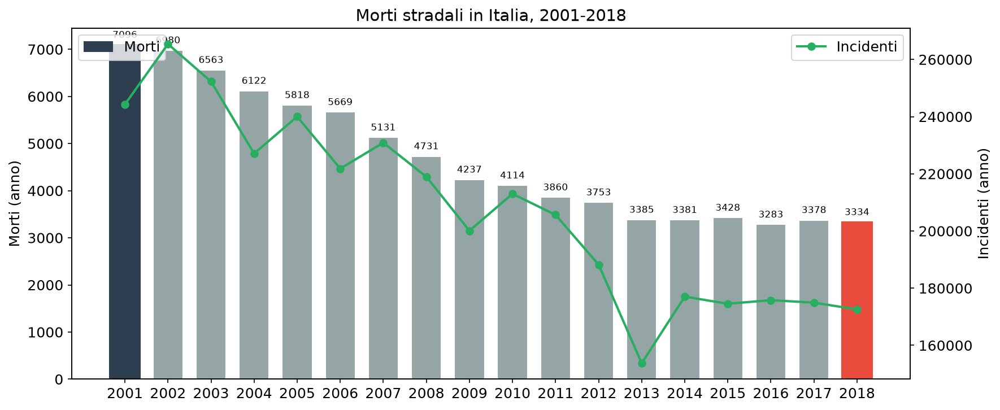
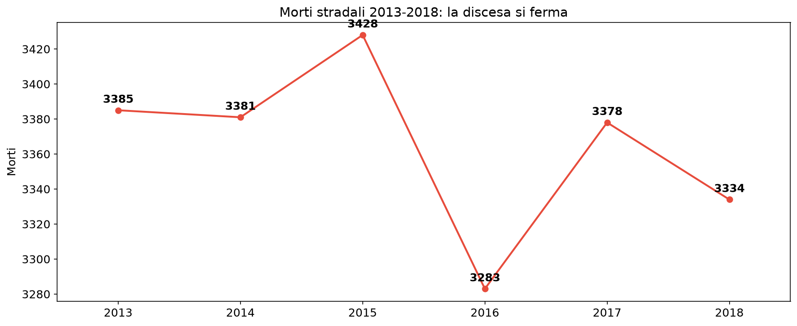
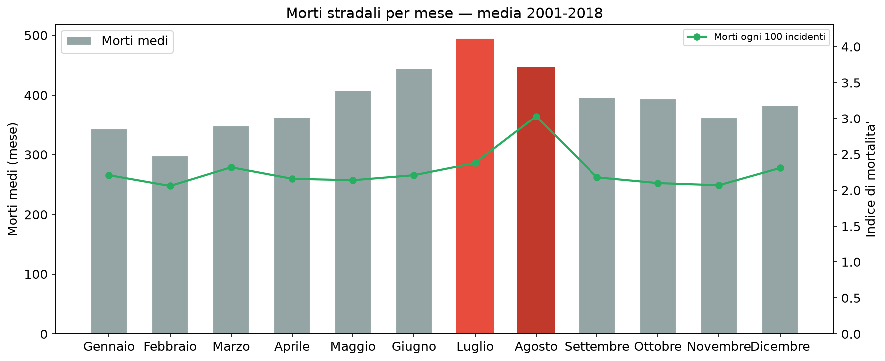
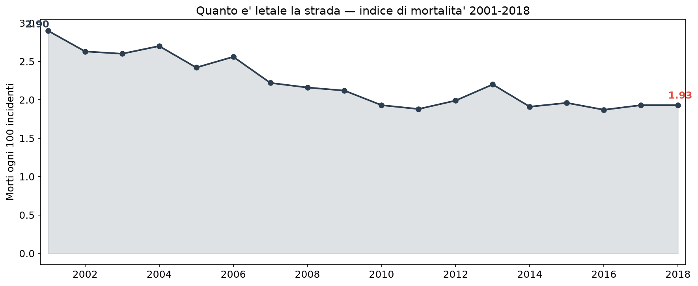

# Incidenti stradali: 84.263 vite in 18 anni — dai 7.000 morti annui al plateau del 2018

**Tra il 2001 e il 2018 i morti sulle strade italiane crollano da 7.096 a 3.334: -53% in un diciottesimo di secolo. Ma il racconto non finisce qui. Dal 2013 la discesa si ferma — in sei anni si risparmiano appena 51 vite — e la stagionalità rivela un dettaglio scomodo: ad agosto, quando le strade si svuotano, ogni incidente è più letale che in qualsiasi altro mese.**

> In 18 anni: **84.263 morti**, **5,09 milioni di feriti**, **3,74 milioni di incidenti**
> Morti: **7.096 (2001) → 3.334 (2018)**, *-53%*
> Incidenti: **244.272 → 172.553**, *-29%* — i feriti calano ancora meno: *-17%*
> Dal **2013 al 2018** morti praticamente fermi: *-51* (-1,5%)

---

## 1. In 18 anni i morti si dimezzano — ma gli incidenti molto meno

La strada è diventata più sicura, ma non a colpi di meno traffico: gli incidenti scendono del 29% mentre le vittime del 53%. Significa che ogni incidente uccide meno — il tema della sezione 4 — e che i progressi sulla rete stradale hanno contato più dei soli volumi.

| Anno | Morti | Feriti | Incidenti | Var. % morti |
|------|------:|-------:|----------:|-------------:|
| 2001 | 7.096 | 293.384 | 244.272 | — |
| 2002 | 6.980 | 378.492 | 265.402 | -1,6% |
| 2003 | 6.563 | 330.879 | 252.271 | -6,0% |
| 2004 | 6.122 | 318.141 | 227.074 | -6,7% |
| 2005 | 5.818 | 334.858 | 240.011 | -5,0% |
| 2006 | 5.669 | 308.448 | 221.816 | -2,6% |
| 2007 | 5.131 | 325.850 | 230.871 | -9,5% |
| 2008 | 4.731 | 289.373 | 218.963 | -7,8% |
| 2009 | 4.237 | 307.258 | 200.096 | -10,4% |
| 2010 | 4.114 | 256.795 | 212.997 | -2,9% |
| 2011 | 3.860 | 271.967 | 205.638 | -6,2% |
| 2012 | 3.753 | 203.531 | 188.228 | -2,8% |
| 2013 | 3.385 | 235.443 | 153.741 | -9,8% |
| 2014 | 3.381 | 251.147 | 177.031 | -0,1% |
| 2015 | 3.428 | 246.920 | 174.539 | +1,4% |
| 2016 | 3.283 | 249.175 | 175.791 | -4,2% |
| 2017 | 3.378 | 246.750 | 174.933 | +2,9% |
| 2018 | 3.334 | 242.919 | 172.553 | -1,3% |

Il decennio 2001-2010 è quello della svolta: ogni anno i morti scendono tra il 3% e il 10%. Il picco di risparmio in valori assoluti è nel 2009 (-10,4%), l'anno della crisi e del minor traffico.

## 2. La discesa si ferma: il plateau 2013-2018

L'ultimo scorcio della serie è un pavimento. Dal 2013 al 2018 i morti oscillano tra 3.283 (2016) e 3.428 (2015), senza più una tendenza chiara: in sei anni il saldo è **-51 vite**.

| Anno | Morti | Var. % |
|------|------:|-------:|
| 2013 | 3.385 | — |
| 2014 | 3.381 | -0,1% |
| 2015 | 3.428 | +1,4% |
| 2016 | **3.283** | -4,2% |
| 2017 | 3.378 | +2,9% |
| 2018 | 3.334 | -1,3% |

Dopo il 2018 il dato pubblico disponibile si interrompe: quanto l'analisi qui conclusa può dire è che la fase di forte riduzione si è esaurita ben prima — il grosso del miglioramento è concentrato nel primo decennio.

## 3. L'estate uccide di più — e agosto è il più letale

La mortalità segue la mobilità: luglio è il mese con più morti, con una media di 493 vite al mese, contro le 298 di febbraio. Ma il dettaglio che emerge guardando l'**indice di mortalità** (morti ogni 100 incidenti) è più sottile: ad agosto gli incidenti calano (le strade degli italiani si spopolano per le ferie) **ma sono i più letali dell'anno** — 3,03 morti ogni 100 incidenti, contro 2,06 di febbraio.

| Mese | Morti medi | Morti ogni 100 incidenti |
|------|-----------:|-------------------------:|
| Gennaio | 343 | 2,21 |
| Febbraio | 298 | **2,06** |
| Marzo | 348 | 2,32 |
| Aprile | 363 | 2,16 |
| Maggio | 408 | 2,14 |
| Giugno | 445 | 2,21 |
| Luglio | **494** | 2,38 |
| Agosto | 446 | **3,03** |
| Settembre | 397 | 2,18 |
| Ottobre | 394 | 2,10 |
| Novembre | 362 | 2,07 |
| Dicembre | 383 | 2,31 |

Due letture, ugualmente rilevanti: ad agosto ogni incidente è in media **il 47% più letale** di febbraio (più velocità, meno traffico, spostamenti lunghi e notturni), e l'estate concentra il rischio in assoluto (giugno-ottobre sono i mesi con più incidenti).

## 4. Strade meno letali — l'indice di mortalità cala di un terzo

L'indicatore sintetico racconta il progresso nascosto nelle tabelle: nel 2001 ogni 100 incidenti morivano 2,90 persone, nel 2018 ne muoiono **1,93** — un calo del **-33%**. La strada italiana ha fatto molti più progressi sulla letalità degli incidenti che sulla loro frequenza.

L'evoluzione dell'indice ricalca la curva dei morti: discesa forte nel primo decennio, poi un appiattimento dal 2013 in poi, con valori stabili tra 1,87 e 1,96.

## Cosa abbiamo imparato

### I fatti

1. **I morti stradali sono più che dimezzati** — da 7.096 (2001) a 3.334 (2018), -53%; in 18 anni **84.263 vite** perse.
2. **Il miglioramento è concentrato nel primo decennio** — dal 2013 al 2018 la mortalità si ferma: -51 vite in sei anni, senza più tendenza.
3. **Agosto è il mese più letale** — 3,03 morti ogni 100 incidenti, il 47% in più di febbraio: poco traffico ma incidenti più gravi.
4. **Le strade uccidono meno per incidente** — l'indice di mortalità cala del 33% (2,90 → 1,93): è la chiave del risparmio di vite.

### E allora?

Se il calo delle vittime era soprattutto merito di reti e mezzi più sicuri, perché dal 2013 la curva si è fermata a quota ~3.300 morti l'anno? Quanto di quel pavimento è comportamento (velocità, distrazioni) e quanto infrastruttura mancante? La domanda civica che i dati lasciano aperta: **di che cosa abbiamo smesso di occuparci dal 2013?**

---

## Dataset

- **Fonte**: MIT — Ministero delle Infrastrutture e dei Trasporti, portale open data
- **Copertura temporale**: 2001-2018 (216 mesi)
- **Dataset in clean-query**: `mit_incidentalita_mensile`

### Limiti

- La serie termina nel 2018: non rileva i successivi aggiornamenti MIT/Aci-Istat.
- È un'elaborazione **nazionale e mensile**: non disaggregata per regione o provincia, quindi non permette confronti territoriali.
- Gli indici di mortalità sono calcolati sul rapporto aggregato (morti/incidenti del periodo), non su medie mensili pre-calcolate dalla fonte.

---

## Notebook

- `notebooks/mit_incidentalita_v1.ipynb` — validazione dati, generazione figure in `figures/`

## Contratto tecnico

[candidates/mit-incidentalita-mensile-2001-2018](https://github.com/dataciviclab/dataset-incubator/tree/main/candidates/mit-incidentalita-mensile-2001-2018)