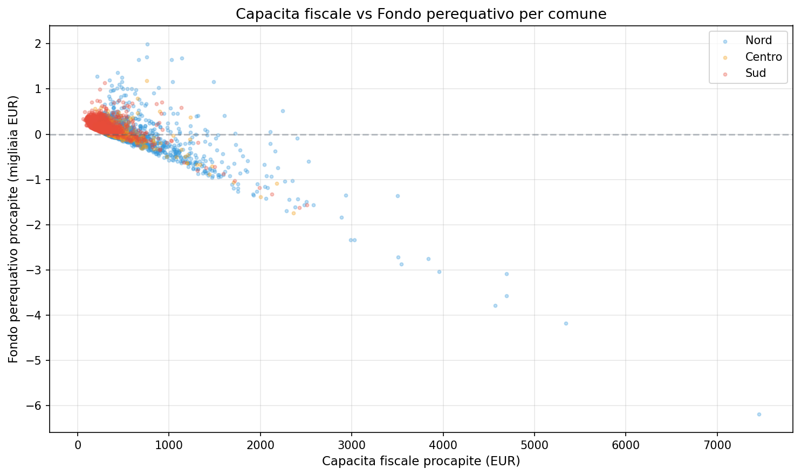

# Fondo di Solidarietà Comunale 2025 — la perequazione funziona

**La correlazione tra capacità fiscale e fondo perequativo è -0,784: più un comune è ricco, meno riceve. Il meccanismo del FSC 2025 funziona nella direzione attesa, ma la redistribuzione è parziale e la dotazione finale resta legata alla capacità fiscale originaria.**

Nel 2025, il Fondo di Solidarietà Comunale ha coinvolto **6.572 comuni** delle Regioni a Statuto Ordinario. Di questi, **1.693 (il 26%)** sono contributori netti: versano più di quanto ricevono. Si tratta dei comuni con capacità fiscale più alta, che alimentano il fondo perequativo a favore dei comuni più poveri.

> Correlazione CF vs FP: **-0,784** (forte e negativa = il meccanismo funziona).
> Contributori netti: **1.693 comuni** (26% del totale).
> CF media contributori: **631 EUR/ab** (quasi il doppio della media nazionale).
> Da P10 a P90: **x3** (196 → 586 EUR/ab).

---

## 1. La geografia della capacità fiscale

La capacità fiscale procapite varia enormemente tra regioni. Liguria guida (711 EUR/ab), Calabria chiude (202 EUR/ab).

| Regione | Comuni | CF procapite | FP procapite | DF procapite |
|---------|--------|-------------|-------------|-------------|
| Liguria | 235 | 711 | -148 | 14 |
| Piemonte | 1.181 | 498 | 56 | 149 |
| Toscana | 274 | 475 | -33 | 95 |
| Emilia-Romagna | 331 | 469 | -38 | 101 |
| Lombardia | 1.503 | 431 | -3 | 105 |
| Veneto | 561 | 413 | -16 | 96 |
| Abruzzo | 306 | 392 | 152 | 229 |
| Umbria | 93 | 371 | 94 | 181 |
| Marche | 226 | 342 | 111 | 179 |
| Lazio | 379 | 321 | 128 | 185 |
| Molise | 137 | 291 | 259 | 290 |
| Puglia | 258 | 263 | 125 | 164 |
| Campania | 551 | 227 | 182 | 220 |
| Basilicata | 132 | 211 | 273 | 330 |
| Calabria | 405 | 202 | 248 | 286 |

Le regioni del Nord (Liguria, Piemonte, Emilia-Romagna) hanno fondo perequativo medio **negativo**: i loro comuni contribuiscono al fondo. Le regioni del Sud ricevono: Calabria, Basilicata e Molise hanno i fondi procapite più alti.

## 2. Il meccanismo perequativo

La correlazione tra capacità fiscale e fondo perequativo è **-0,784**: fortemente negativa. Significa che all'aumentare della capacità fiscale, il fondo perequativo diminuisce — esattamente come dovrebbe funzionare un meccanismo perequativo.

| Indicatore | Valore | Interpretazione |
|-----------|--------|----------------|
| Corr CF vs FP | **-0,784** | Forte correlazione negativa — il meccanismo funziona |
| Corr CF vs DF | **-0,636** | Correlazione negativa, ma più debole |
| Contributori netti | **1.693 comuni (26%)** | Un quarto dei comuni finanzia il fondo |
| CF media contributori | **631 EUR/ab** | Capacità fiscale molto sopra la media |

La correlazione tra capacità fiscale e **dotazione finale FSC** è solo -0,636: la dotazione finale è meno redistributiva del solo fondo perequativo, perché include risorse storiche che attenuano la perequazione.

## 3. Distribuzione della capacità fiscale

La capacità fiscale procapite ha una distribuzione molto diseguale tra i comuni RSO.

| Percentile | CF procapite |
|-----------|-------------|
| P10 | 196 EUR/ab |
| P25 | 272 EUR/ab |
| P50 (mediana) | 341 EUR/ab |
| P75 | 421 EUR/ab |
| P90 | 586 EUR/ab |

Il rapporto tra P90 e P10 è di **3 a 1**: i comuni al decile più alto hanno una capacità fiscale tripla rispetto a quelli del decile più basso.

---

## Cosa abbiamo imparato

### I fatti

1. **Il FSC 2025 funziona**: la correlazione negativa (-0,784) tra capacità fiscale e fondo perequativo conferma che i comuni più ricchi contribuiscono e i più poveri ricevono.
2. **Il 26% dei comuni RSO** (1.693) sono contributori netti, con una capacità fiscale media di 631 EUR/ab.
3. **La dotazione finale è meno redistributiva** del fondo perequativo (corr -0,636 vs -0,784), perché include risorse storiche.
4. **La Liguria è la regione con la CF procapite più alta** (711 EUR/ab) e fondo perequativo negativo (-148 EUR/ab).
5. **La Calabria ha la CF più bassa** (202 EUR/ab) e il fondo perequativo più alto (248 EUR/ab).

### E allora?

Il FSC 2025 redistribuisce risorse dai comuni ricchi a quelli poveri, ma la dotazione finale è ancora parzialmente legata alla capacità fiscale originaria. La domanda che resta: **quanta perequazione è sufficiente per garantire servizi equivalenti su tutto il territorio, senza disincentivare la crescita della capacità fiscale locale?**

---

## Dataset

- **Fonte**: OpenCivitas / Sogei — FSC 2025 per comuni RSO
- **Copertura**: 6.572 comuni delle Regioni a Statuto Ordinario, dati 2025
- **Metriche**: capacità fiscale, fondo perequativo, dotazione finale FSC, IMU/TASI standard, risorse storiche, popolazione
- **Dataset in clean-query**: `opencivitas_fsc_2025_rso`

### Limiti

- Solo comuni RSO (escluse Regioni a Statuto Speciale e Province Autonome)
- Dati 2025 (un solo anno, nessuna serie storica)
- La capacità fiscale è calcolata su base IMU/TASI standard, non sul gettito effettivo
- Le risorse storiche incluse nella dotazione finale attenuano l'effetto perequativo puro

---

## Notebook

- `notebooks/opencivitas_fsc_v2.ipynb` — validazione dati, genera figure in `figures/`

## Contratto tecnico

[candidates/opencivitas-fsc-rso](https://github.com/dataciviclab/dataset-incubator/tree/main/candidates/opencivitas-fsc-rso)
