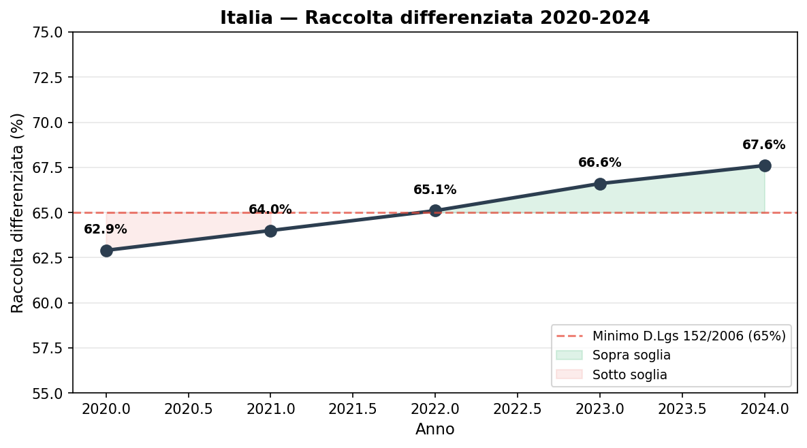
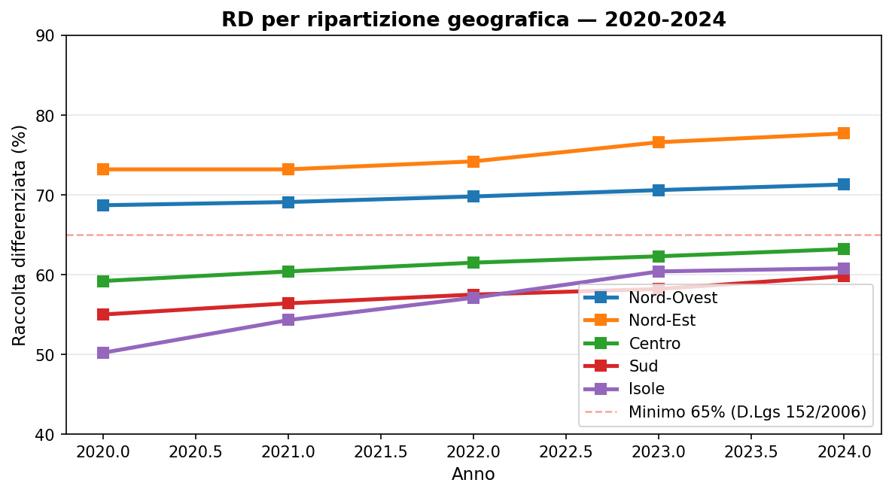
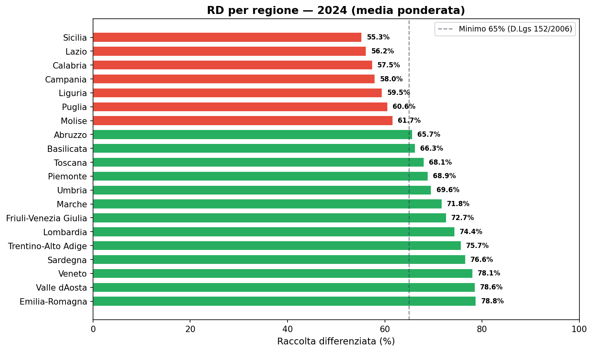
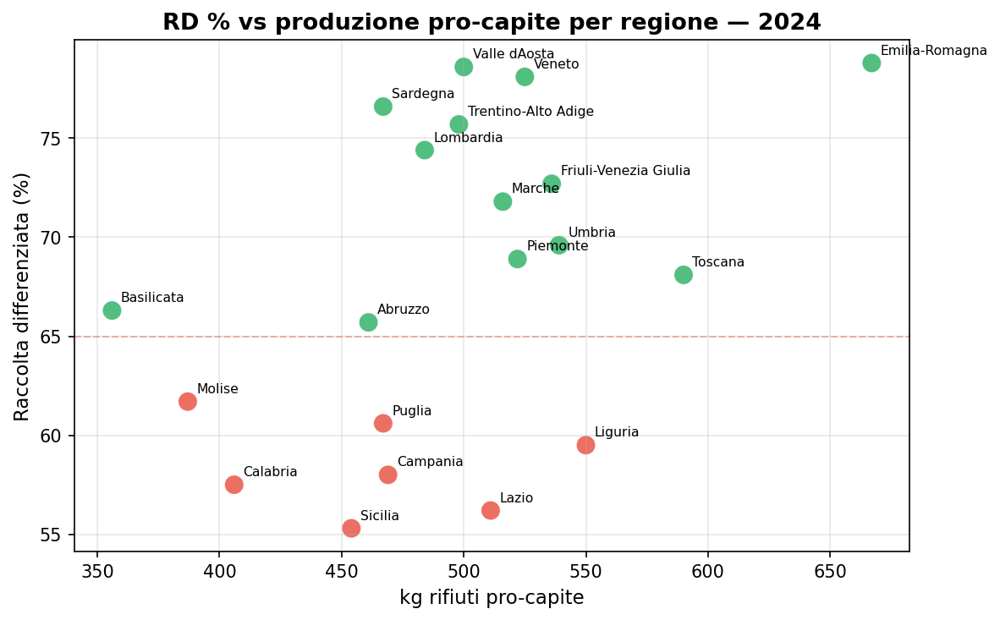
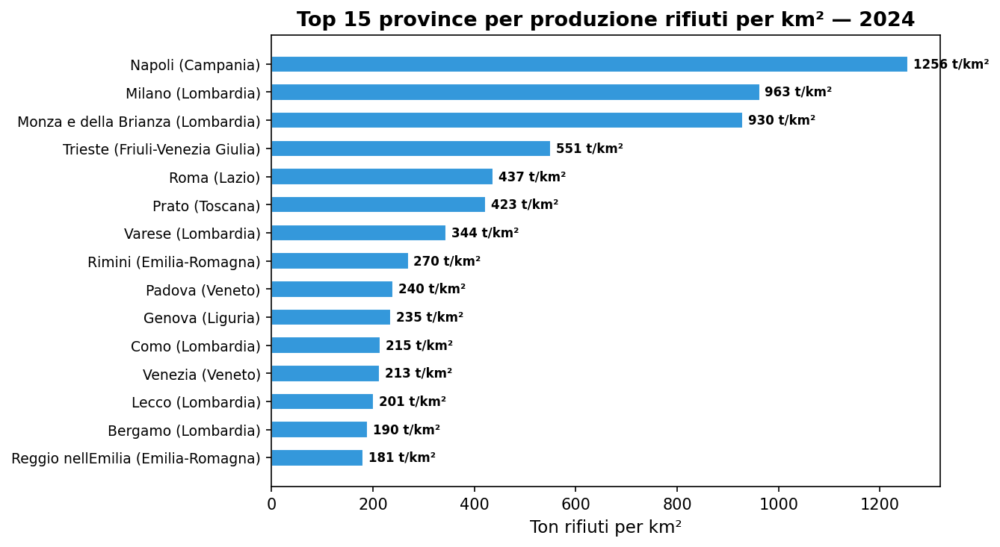
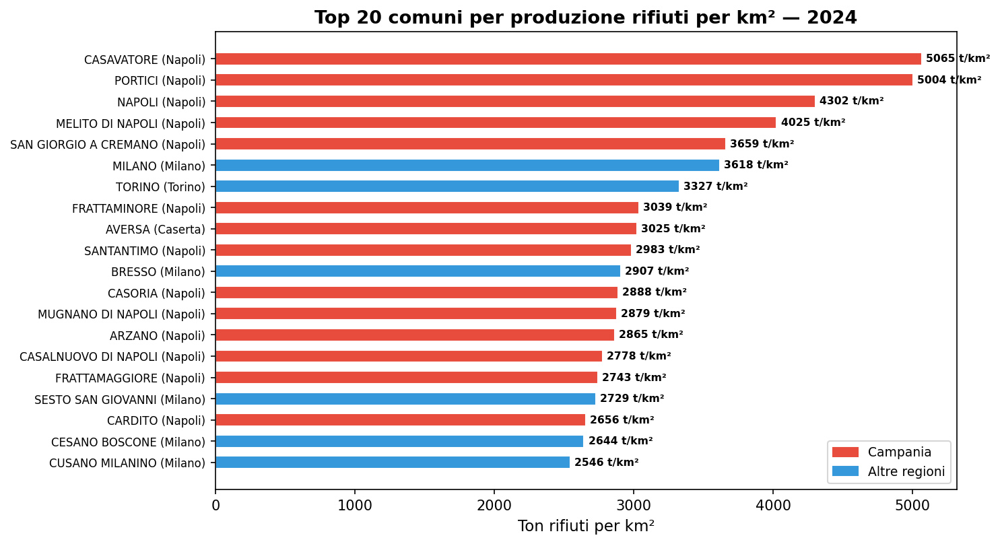

# Rifiuti per km² — dove si produce di più?

**Napoli produce 4.302 tonnellate di rifiuti per km², Milano 3.618. Il comune più denso, Casavatore (NA, 1,61 km²), supera le 5.000 ton/km²: in un territorio grande come un parco urbano, ogni anno si producono oltre 8.100 tonnellate di rifiuti.**

Normalizzare la produzione di rifiuti per superficie territoriale racconta una storia diversa dalla classifica per tonnellate assolute o pro-capite. Le piccole amministrazioni ad altissima densità abitativa — tipicamente nell'hinterland napoletano e milanese — gestiscono carichi di rifiuti per km² paragonabili a quelli di interi capoluoghi.

> Italia 2024: **29,5 milioni di tonnellate** di rifiuti urbani.
> Raccolta differenziata nazionale: **67,6%** (era 62,9% nel 2020).
> 13 regioni su 20 sopra il minimo del 65% (D.Lgs 152/2006).
> 7 regioni sotto soglia, la maggior parte al Sud e Isole.

---

## 1. Il trend nazionale: verso il 68%

Dal 2020 la raccolta differenziata è cresciuta in modo costante, passando dal 62,9% al 67,6%. **Il 2023 è stato l'anno del sorpasso**: l'Italia ha superato la soglia del 65% prevista dall'art. 205 del D.Lgs. 152/2006 (che fissa un obiettivo minimo nazionale, non UE — l'UE stabilisce invece un obiettivo di **riciclaggio** al 65% entro il 2035).

| Anno | Comuni | RD nazionale | Variazione |
|------|--------|-------------|------------|
| 2020 | 7.628 | 62,9% | — |
| 2021 | 7.618 | 64,0% | +1,1 pt |
| 2022 | 7.631 | 65,1% | +1,1 pt |
| 2023 | 7.669 | **66,6%** | +1,5 pt |
| 2024 | 7.671 | **67,6%** | +1,0 pt |

La media nazionale nasconde differenze profonde. **7 regioni sono ancora sotto il 65%**: Sicilia (55,3%), Lazio (56,2%), Calabria (57,5%), Campania (58,0%), Liguria (59,5%), Puglia (60,6%) e Molise (61,7%).

La tabella usa la **media ponderata** (totale RD / totale RU), che è la metrica corretta per misurare la performance di un'area geografica. La media semplice delle percentuali comunali — spesso citata nei report — sovrastima le regioni con tanti piccoli comuni virtuosi.

| Regione | RD pesata | RD media semplice | Differenza |
|---------|-----------|-------------------|------------|
| Sicilia | **55,3%** | 70,4% | −15,1 pt |
| Campania | **58,0%** | 67,3% | −9,3 pt |
| Lazio | **56,2%** | 63,9% | −7,7 pt |

Il dato siciliano è emblematico: i piccoli comuni differenziano bene (media 70,4%), ma Palermo e Catania — che producono la maggior parte dei rifiuti — hanno percentuali molto basse, facendo crollare la media ponderata al 55,3%.

## 2. Il divario territoriale per ripartizione geografica

Usando le **ripartizioni ISTAT** (Nord-Ovest, Nord-Est, Centro, Sud, Isole), il quadro è più preciso di un generico Nord-Sud.

| Ripartizione | 2020 | 2021 | 2022 | 2023 | 2024 |
|--------------|------|------|------|------|------|
| **Nord-Est** | 73,2% | 73,2% | 74,1% | 76,6% | **77,7%** |
| **Nord-Ovest** | 68,7% | 69,1% | 69,8% | 70,6% | **71,3%** |
| **Centro** | 59,2% | 60,4% | 61,5% | 62,3% | **63,2%** |
| **Sud** | 55,0% | 56,4% | 57,5% | 58,2% | **59,8%** |
| **Isole** | 50,2% | 54,4% | 57,2% | 60,4% | **60,8%** |

Il Nord-Est guida con il 77,7%, seguito dal Nord-Ovest (71,3%). Il Centro è a 63,2%, sotto la soglia del 65%, ma in crescita. Sud e Isole sono più distanti ma le Isole hanno quasi colmato il gap col Centro grazie al balzo della Sicilia (+13,2 punti dal 2020). Il Lazio (56,2% nel 2024) è la regione del Centro che pesa negativamente sulla media dell'area.

### La produzione pro-capite non spiega tutto

Le regioni che differenziano di più non sono quelle che producono meno per abitante. Il **Veneto** (78,0% RD) produce 526 kg/ab, l'**Emilia-Romagna** (78,8%) addirittura 667 kg/ab — la più alta in Italia. Regioni con bassa RD come la **Basilicata** producono solo 356 kg/ab ma hanno il 66,3% di RD. La differenziata è una scelta organizzativa, non una conseguenza della quantità prodotta.

## 3. La pressione sul territorio: rifiuti per km²

Guardare alle tonnellate per km² cambia la prospettiva. Le province con la più alta densità di rifiuti sono aree metropolitane densamente urbanizzate.

| Provincia | Regione | Comuni | Ton/km² |
|-----------|---------|--------|---------|
| **Napoli** | Campania | 91 | **1.256** |
| **Milano** | Lombardia | 133 | **963** |
| **Monza e Brianza** | Lombardia | 54 | **930** |
| Trieste | Friuli-Venezia Giulia | 6 | 551 |
| Roma | Lazio | 110 | 437 |
| Prato | Toscana | 7 | 423 |
| Varese | Lombardia | 133 | 344 |
| Genova | Liguria | 66 | 235 |
| Padova | Veneto | 100 | 240 |
| Venezia | Veneto | 42 | 213 |

*Nota: sono incluse solo province con copertura ≥ 50% dei comuni nel cross-dataset. La provincia di Aosta registra 775 ton/km² ma rappresenta il solo comune di Aosta.*

La classifica è dominata dall'area metropolitana di Napoli e Milano. Al contrario, le province più estese e meno densamente popolate (Belluno, Sondrio, Potenza, Matera) registrano valori sotto le 30 ton/km².

**A livello regionale**, la densità di produzione rifiuti per superficie è:

| Regione | Ton/km² | Regione | Ton/km² |
|---------|---------|---------|---------|
| Lombardia | 205,5 | Piemonte | 87,7 |
| Campania | 191,0 | Sicilia | 84,1 |
| Lazio | 176,3 | Marche | 81,8 |
| Liguria | 153,6 | Abruzzo | 54,8 |
| Veneto | 138,9 | Calabria | 49,7 |
| Emilia-Romagna | 130,3 | Sardegna | 30,4 |
| Toscana | 94,3 | Basilicata | 18,7 |
| Puglia | 92,7 | | |

*Valle d'Aosta (774,9 ton/km²) e Molise (25,0) sono casi particolari rispettivamente per la dimensione ridotta e la bassa densità.*

## 4. I comuni più densi: la pressione locale

A livello comunale il fenomeno è ancora più marcato. **Dei primi 20 comuni per ton/km², 14 sono in Campania (quasi tutti in provincia di Napoli).** Il record spetta a **Casavatore** (NA): 1,61 km², 5.065 ton/km², con una RD ferma al 45%.

| Comune | Provincia | Superficie | Ton/km² | RD % |
|--------|-----------|-----------|---------|------|
| **Casavatore** | Napoli | 1,61 km² | **5.065** | 45,1% |
| **Portici** | Napoli | 4,64 km² | **5.004** | 58,7% |
| **Napoli** | Napoli | 119,24 km² | **4.302** | 44,4% |
| Melito di Napoli | Napoli | 3,78 km² | 4.025 | 29,4% |
| San Giorgio a Cremano | Napoli | 4,07 km² | 3.659 | 58,4% |
| **Milano** | Milano | 181,76 km² | **3.618** | 63,3% |
| **Torino** | Torino | 130,00 km² | **3.327** | 57,4% |
| Frattaminore | Napoli | 2,04 km² | 3.039 | 51,3% |
| Aversa | Caserta | 8,85 km² | 3.025 | 52,5% |
| Sant'Antimo | Napoli | 5,91 km² | 2.983 | 53,9% |

*Sono esclusi i comuni con superficie < 0,5 km² (es. Atrani, SA: 0,12 km², 2.872 ton/km²) per evitare distorsioni da micro-territori.*

**Cosa emerge**: nei comuni ad altissima densità di produzione — quasi tutti nell'hinterland di Napoli — la raccolta differenziata è sistematicamente più bassa della media nazionale. Casavatore (45,1%), Napoli (44,4%) e Melito di Napoli (29,4%) sono lontanissimi dal 65%. Al contrario, Milano (63,3%) e Monza-Brianza (80,1%) pur con alta densità si avvicinano o superano l'obiettivo, dimostrando che alta densità non è incompatibile con una buona differenziata.

## 5. Chi cresce più velocemente?

Dal 2020 al 2024, le regioni che hanno guadagnato più punti percentuali di RD:

| Regione | RD 2020 | RD 2024 | Delta |
|---------|---------|---------|-------|
| **Sicilia** | 42,1% | 55,3% | **+13,2 pt** |
| Puglia | 54,3% | 60,6% | +6,3 pt |
| Calabria | 51,6% | 57,5% | +5,9 pt |
| Toscana | 62,2% | 68,1% | +5,9 pt |
| Lazio | 52,4% | 56,2% | +3,8 pt |

La **Sicilia** ha compiuto un balzo straordinario (+13,2 punti in 5 anni), passando dal 42,1% al 55,3%. Resta però ancora sotto il 65% perché il punto di partenza era molto basso. La **Puglia** guadagna 6,3 punti ma resta a ridosso della soglia (60,6%). Le regioni già sopra l'obiettivo (Veneto, Sardegna, Emilia-Romagna) migliorano meno, perché partono da posizioni più alte.

---

## Cosa abbiamo imparato

### I fatti

1. **Italia al 67,6% di RD** — L'Italia ha superato il 65% nel 2023 e consolida. Ma 7 regioni su 20 sono ancora sotto la soglia minima nazionale.
2. **Il divario territoriale è netto** — Nord-Est 77,7%, Isole 60,8%. Il Centro stesso (63,2%) è sotto soglia, trainato dal Lazio (56,2%).
3. **Densità non è destino** — Milano mostra che alta densità di rifiuti non impedisce una buona differenziata. I comuni dell'hinterland napoletano combinano altissima pressione ambientale con bassa RD.
4. **Produzione pro-capite non predice RD** — Emilia-Romagna (667 kg/ab) ha RD al 78,8%. Basilicata (356 kg/ab) ha RD al 66,3%.
5. **La media semplice sovrastima le regioni a tanti piccoli comuni** — La RD pesata della Sicilia (55,3%) è 15 punti sotto la media semplice (70,4%). I grandi comuni fanno la differenza.

### E allora?

La domanda non è più "se" si fa la differenziata, ma **perché aree con analoga densità abitativa e produzione pro-capite hanno performance radicalmente diverse?** La risposta è nella governance del servizio, negli investimenti, nei modelli di raccolta. La normalizzazione per km² offre una lente in più: mostra la pressione reale sul territorio, che i soli valori assoluti o pro-capite nascondono.

---

## Dataset

- **Fonte**: ISPRA — Catasto Rifiuti, sezione Rifiuti Urbani
- **Copertura temporale**: 2020-2024 (dati annuali per comune)
- **Copertura geografica**: 7.671 comuni (di cui 7.668 nel cross-dataset, 3 comuni persi per fusione/cessazione)
- **Dataset in clean-query**: `ispra_ru_base` + `istat_elenco_comuni` (per superficie km²)

### Cross-dataset

I codici ISTAT dei comuni sardi sono cambiati dopo la riforma provinciale (2016-2021). ISPRA usa i codici pre-riforma, ISTAT SITUAS 2026 i nuovi. Per la Sardegna il join usa il nome normalizzato (caratteri non-ASCII rimossi) con vincolo regionale: **377/377 comuni matchati**, 0 duplicati.

Per il resto d'Italia il join primario è sul codice ISTAT a 6 cifre. Per i comuni con codice cambiato tra le due versioni (es. Sovizzo VI: 024103 → 024128) si usa un fallback per nome normalizzato + provincia.

**3 comuni** non hanno corrispondenza perché soppressi o fusi prima del 2026: Lirio (PV), Castegnero (VI), Nanto (VI). Copertura complessiva: **99,96%**.

### Limiti

- I dati ISPRA sono auto-dichiarati dai comuni via O.R.SO. — possono esserci disallineamenti nella comunicazione.
- La superficie comunale usata è ISTAT SITUAS 2026. Per comuni con confini variati, la superficie potrebbe non coincidere perfettamente.
- 7.671 comuni su ~7.900: mancano circa 230 comuni che non hanno comunicato i dati rifiuti all'ISPRA per il 2024.
- La RD è calcolata come **media ponderata** (totale RD / totale RU), non come media semplice delle percentuali comunali.
- Il dato di produzione non distingue tra rifiuti domestici e assimilati.

---

## Notebook

- `notebooks/rifiuti-km2_v2.ipynb` — validazione dati e generazione figure (eseguito, con output)

## Contratto tecnico

- [`candidates/ispra-ru-base`](https://github.com/dataciviclab/dataset-incubator/tree/main/candidates/ispra-ru-base)
- [`support_datasets/istat-elenco-comuni`](https://github.com/dataciviclab/dataset-incubator/tree/main/support_datasets/istat-elenco-comuni)
