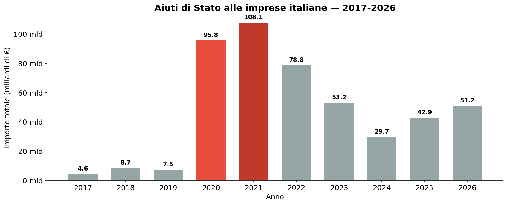
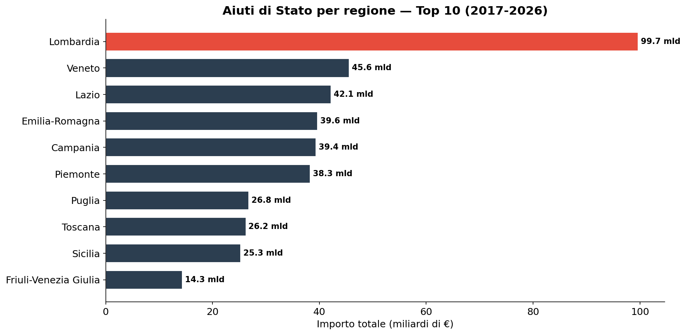
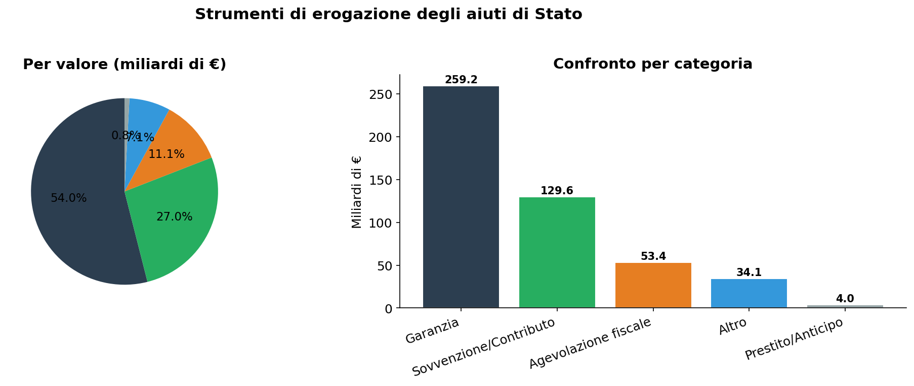
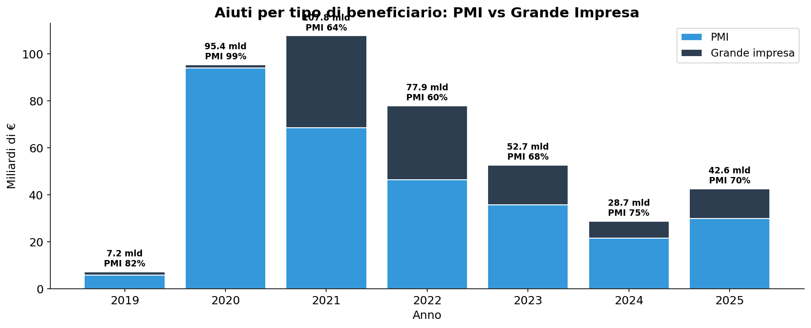
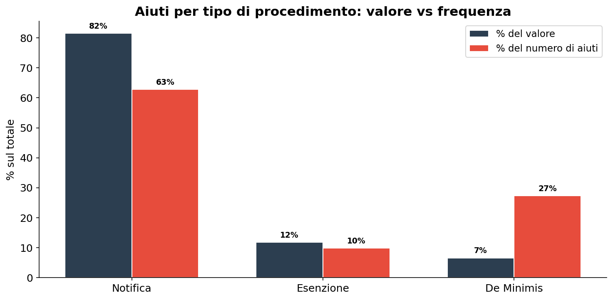
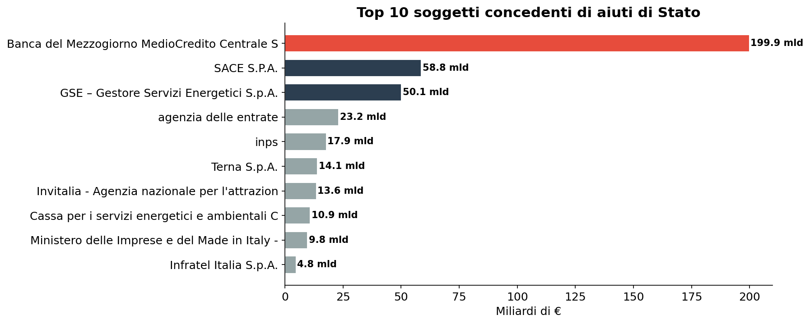

# Aiuti di Stato: 470 miliardi in 9 anni — la mappa del denaro pubblico alle imprese italiane

**Tra il 2017 e il 2026 lo Stato italiano ha concesso 470 miliardi di euro in aiuti alle imprese. Il biennio 2020-2021, da solo, vale il 43% del totale: lo shock COVID ha moltiplicato per 20 l'erogazione annuale, passata da 4,6 miliardi (2017) a 108 miliardi (2021).**

> 17 milioni di aiuti erogati · 470 miliardi di € · 2,3 milioni di imprese coinvolte

---

## 1. L'onda COVID: da 4,6 a 108 miliardi in un anno

L'effetto pandemia è netto e senza precedenti. Nel 2020 le erogazioni passano da 7,5 a 95,8 miliardi di euro, un balzo di 13 volte rispetto all'anno precedente. Il picco arriva nel 2021 (108 miliardi), per poi scendere gradualmente.

L'andamento mostra tre fasi distinte:
- **2017-2019**: regime pre-COVID, sotto i 9 miliardi annui
- **2020-2021**: emergenza, oltre 200 miliardi in due anni
- **2022-2026**: progressivo rientro, ma con volumi ancora 5-10 volte superiori al pre-pandemia

| Anno | Importo (mld €) | Numero aiuti | Variazione anno precedente |
|------|-----------------|--------------|---------------------------|
| 2017 | 4,6 | 216.931 | — |
| 2018 | 8,7 | 696.534 | +90% |
| 2019 | 7,5 | 524.502 | -14% |
| **2020** | **95,8** | 2.539.967 | **+1.177%** |
| **2021** | **108,1** | 2.722.096 | +13% |
| 2022 | 78,8 | 2.134.404 | -27% |
| 2023 | 53,2 | 2.946.581 | -33% |
| 2024 | 29,7 | 2.413.641 | -44% |
| 2025 | 42,9 | 2.139.134 | +45% |

## 2. Dove sono finiti i soldi? La distribuzione regionale

La Lombardia assorbe 99,7 miliardi, un quinto del totale nazionale. Seguono Veneto e Lazio con circa 45 miliardi ciascuno. Ma il dato rilevante è la concentrazione: le prime 5 regioni (Lombardia, Veneto, Lazio, Emilia-Romagna, Campania) totalizzano il 56% delle erogazioni.

| Regione | Importo (mld €) | Aiuti | Imprese coinvolte |
|---------|-----------------|-------|-------------------|
| Lombardia | 99,7 | 2.482.275 | 742.375 |
| Veneto | 45,6 | 1.418.316 | 372.289 |
| Lazio | 42,2 | 1.167.745 | 423.383 |
| Emilia-Romagna | 39,6 | 1.165.013 | 353.046 |
| Campania | 39,4 | 1.876.450 | 473.308 |
| Piemonte | 38,3 | 1.077.941 | 334.443 |
| Puglia | 26,8 | 1.210.697 | 276.606 |
| Toscana | 26,2 | 1.049.561 | 326.611 |
| Sicilia | 25,3 | 1.366.548 | 300.405 |
| Calabria | 7,9 | 528.585 | 145.715 |

## 3. Strumenti: garanzie, sovvenzioni e agevolazioni fiscali

Il 55% degli aiuti è erogato sotto forma di **garanzie** (259 miliardi), seguite da **sovvenzioni e contributi** (120 miliardi) e **agevolazioni fiscali** (53 miliardi). Le garanzie dominano in valore ma non in frequenza: le agevolazioni fiscali sono lo strumento più usato in termini di numero di operazioni (6,5 milioni).

## 4. PMI e Grandi Imprese: chi ha preso cosa?

Il COVID ha cambiato le proporzioni: nel 2019 le PMI assorbivano l'82% degli aiuti, nel 2021 solo il 64%, perché le grandi imprese hanno accesso a strumenti di garanzia di dimensioni molto maggiori. Nel 2023 le PMI tornano al 68% del totale.

| Anno | PMI (mld) | Grande impresa (mld) | % PMI |
|------|-----------|---------------------|-------|
| 2019 | 5,9 | 1,3 | 82% |
| 2020 | 94,1 | 1,3 | 99% |
| 2021 | 68,5 | 39,2 | 64% |
| 2023 | 35,8 | 16,9 | 68% |

## 5. Procedimenti: Notifica, Esenzione, De Minimis

L'83% del valore degli aiuti passa attraverso la procedura di **Notifica** (autorizzazione preventiva della Commissione Europea). Gli aiuti **De Minimis**, pur essendo il 28% delle operazioni, valgono solo il 7% del totale — sono piccoli contributi che non richiedono notifica.

| Procedimento | Importo (mld) | % valore | % numero |
|-------------|--------------|----------|----------|
| Notifica | 391,7 | 81,5% | 63% |
| Esenzione | 56,9 | 11,8% | 10% |
| De Minimis | 31,8 | 6,6% | 27% |

## 6. I grandi erogatori: MCM, SACE, GSE

Solo **Banca del Mezzogiorno / MedioCredito Centrale** ha erogato 200 miliardi di euro, il 42% del totale. Seguono **SACE** (59 mld) e **GSE** (50 mld). I primi tre soggetti concedenti coprono il 64% di tutti gli aiuti.

## Cosa abbiamo imparato

### I fatti

1. **L'effetto COVID è stato enorme e concentrato**: in due anni (2020-2021) lo Stato ha erogato più della metà degli aiuti totali dell'intero decennio. L'importo medio per aiuto è passato da 14.000 € (2019) a 39.000 € (2021).
2. **La distribuzione territoriale è disomogenea**: la Lombardia da sola ha ricevuto quanto le ultime 8 regioni messe insieme, ma il dato va letto alla luce della dimensione del tessuto produttivo.
3. **Le garanzie sono lo strumento dominante**: il 55% del valore è garantito, non erogato direttamente. Questo significa che il rischio è solo potenziale, ma l'esposizione dello Stato è reale.
4. **Il 7% degli aiuti vale l'1% ma riguarda il 27% delle operazioni**: gli aiuti De Minimis (sotto 200.000 €) sono micro-interventi capillari.

### E allora?

_Dopo il 2021 gli aiuti sono calati, ma nel 2025 sono ancora 10 volte superiori al 2019. È fisiologico o strutturale? Il dato 2025 (42,9 mld) suggerisce che il nuovo «normale» è molto più alto del passato. Questi aiuti stanno producendo gli effetti sperati sulla competitività del sistema produttivo?_

---

## Dataset

- **Fonte**: [MIMIT — Registro Nazionale Aiuti di Stato](https://www.rna.gov.it/)
- **Copertura temporale**: 2017-2026 (dati aggiornati a giugno 2026)
- **Dataset in clean-query**: `rna_aiuti_stato`
- **17 milioni di righe**, 31 colonne

### Limiti

- I dati includono sia aiuti effettivamente erogati che impegni formali — la distinzione non è sempre netta.
- Gli importi sono in "elemento aiuto" (ESL — equivalente sovvenzione lordo), non necessariamente flussi di cassa.
- L'importo nominale (dichiarato dall'operazione) può differire dall'ESL.

---

## Notebook

- `notebooks/rna_aiuti_stato_v2.ipynb` — validazione dati, genera figure in `figures/`
- Eseguito con DuckDB su GCS pubblico (anonimo)

## Contratto tecnico

[candidates/rna-aiuti-stato](https://github.com/dataciviclab/dataset-incubator/tree/main/candidates/rna-aiuti-stato)
