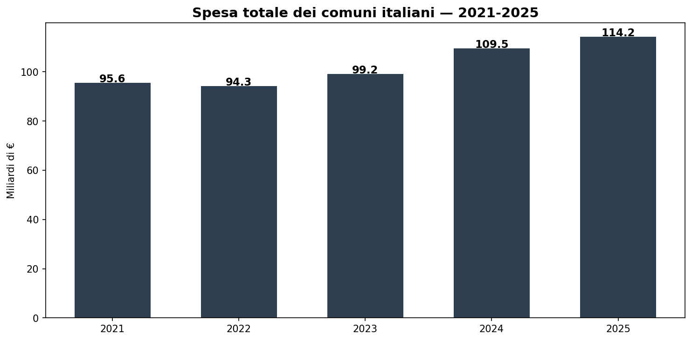
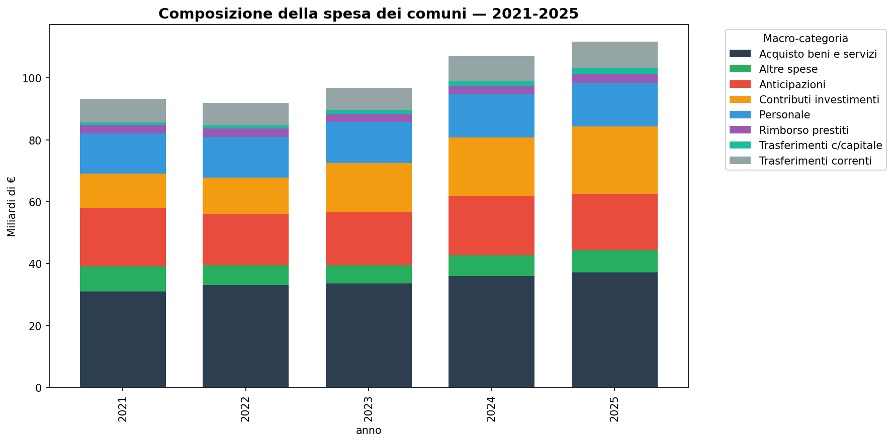
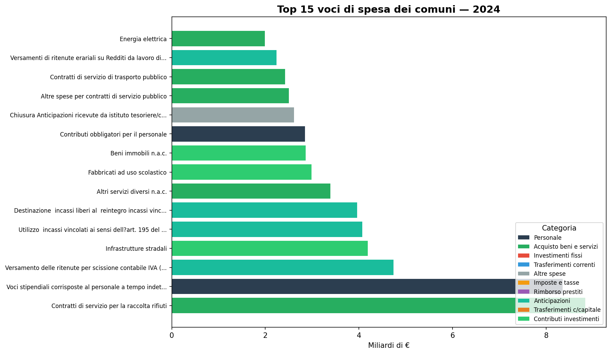
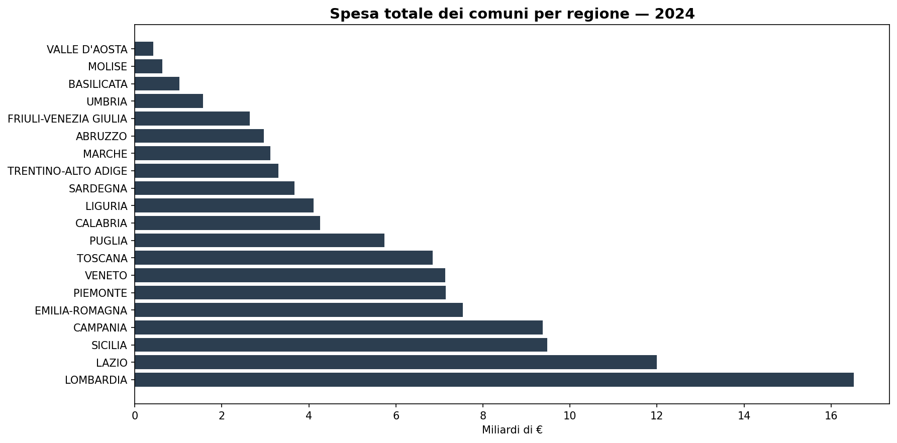
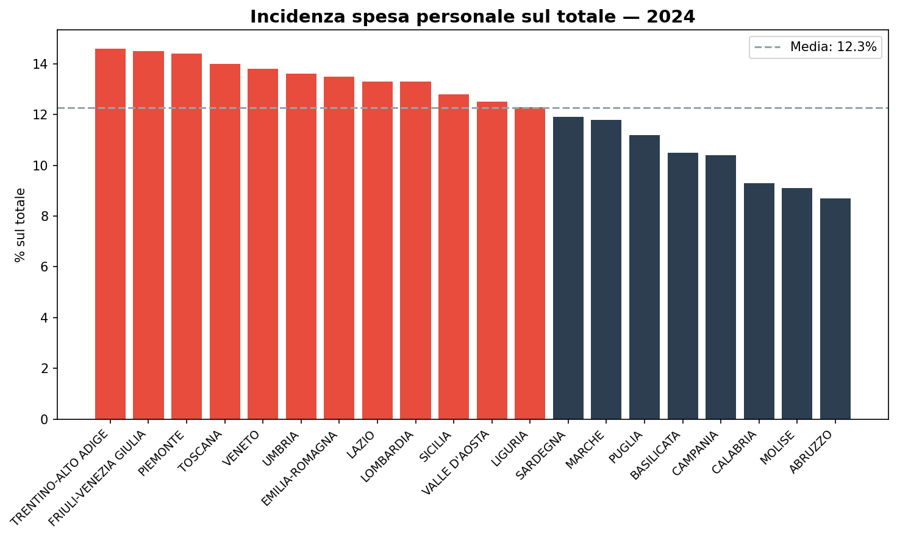

# Dove vanno i soldi dei comuni italiani?

**Nel 2024 i comuni italiani hanno speso circa 109 miliardi di euro.** La voce più pesante è l'acquisto di beni e servizi (36 miliardi, di cui quasi 9 solo per la raccolta rifiuti), seguita dagli investimenti in contributi (19 miliardi) e dal personale (14 miliardi).

---

## 1. Trend nazionale 2021-2025

La spesa totale dei comuni è cresciuta da 95,6 miliardi nel 2021 a **109,5 miliardi nel 2024** (+14,5% in tre anni). Il 2025 mostra 114,2 miliardi, ma è un dato parziale (anno in corso).

| Anno | Spesa totale (mld €) |
|------|---------------------:|
| 2021 | 95,6 |
| 2022 | 94,3 |
| 2023 | 99,2 |
| 2024 | 109,5 |
| 2025 | 114,2* |

*2025: dato parziale (anno in corso).

## 2. Dove vanno i soldi?

La componente più grande è **l'acquisto di beni e servizi** (36 mld nel 2024, il 33% del totale), seguita dalle **anticipazioni e partite di giro** (19 mld) e dai **contributi agli investimenti** (19 mld). Il personale pesa per 13,9 miliardi (13%).

Le voci di spesa più consistenti nel 2024:

| Voce di spesa | Categoria | Miliardi € |
|---|---|---|
| Contratti di servizio per la raccolta rifiuti | Acquisto beni e servizi | 8,8 |
| Stipendi personale a tempo indeterminato | Personale | 8,4 |
| Split payment IVA | Anticipazioni | 4,7 |
| Infrastrutture stradali | Contributi investimenti | 4,2 |
| Utilizzo incassi vincolati (art. 195 TUEL) | Anticipazioni | 4,1 |

## 3. Dove si spende di più?

La **Lombardia** guida la spesa comunale con 16,5 miliardi, seguita da Lazio (12 mld), Sicilia (9,5 mld) e Campania (9,4 mld). La classifica rispecchia in gran parte la popolazione, ma non solo.

## 4. Il peso del personale

L'incidenza della spesa per personale sul totale varia dal **14,6% in Trentino** all'**8,7% in Abruzzo**. La media nazionale è dell'11,9%.

---

## Cosa abbiamo imparato

### I fatti

1. **La spesa dei comuni cresce** — da 95,6 a 109,5 miliardi in tre anni (+14,5%).
2. **Beni e servizi è la voce regina** — 36 miliardi, di cui 8,8 solo per la raccolta rifiuti.
3. **Il personale pesa il 12%** della spesa totale, con differenze territoriali marcate (dal 9% in Abruzzo al 15% in Trentino).
4. **Gli investimenti crescono** — i contributi per investimenti passano da 11 a 19 miliardi (+73% tra 2021 e 2024).

### E allora?

La crescita della spesa è trainata dagli investimenti (+8 miliardi in tre anni, effetto PNRR?) più che dalla spesa corrente. Ma la fotografia è ferma al 2024: serviranno i dati 2025-2026 per capire se è un trend strutturale o un effetto congiunturale dei fondi europei.

---

## Dataset

- **Fonte**: SIOPE — Sistema Informativo sulle Operazioni degli Enti Pubblici (Ragioneria Generale dello Stato)
- **Dataset**: `siope_uscite_comuni` (2021-2025) — spese dei comuni italiani
- **Copertura**: 7.910 comuni, 20 regioni
- **Accesso**: `https://storage.googleapis.com/dataciviclab-clean/siope/siope_uscite_comuni/{anno}/siope_uscite_comuni_{anno}_clean.parquet`

### Limiti

- Il 2025 è un anno parziale (dati disponibili fino alla data di estrazione)
- I dati SIOPE registrano gli impegni di spesa, non i pagamenti effettivi
- Le "Anticipazioni" includono partite di giro contabili (split payment, incassi vincolati) che non rappresentano spesa reale

---

## Notebook

- `notebooks/siope-comuni-spesa_v1.ipynb` — validazione dati e generazione figure

## Contratto tecnico

I dati sono estratti dal progetto [open-siope](https://github.com/dataciviclab/open-siope), che pubblica i dati SIOPE puliti su GCS. Il dataset non è ancora nel catalogo clean di dataset-incubator ma è accessibile pubblicamente.
