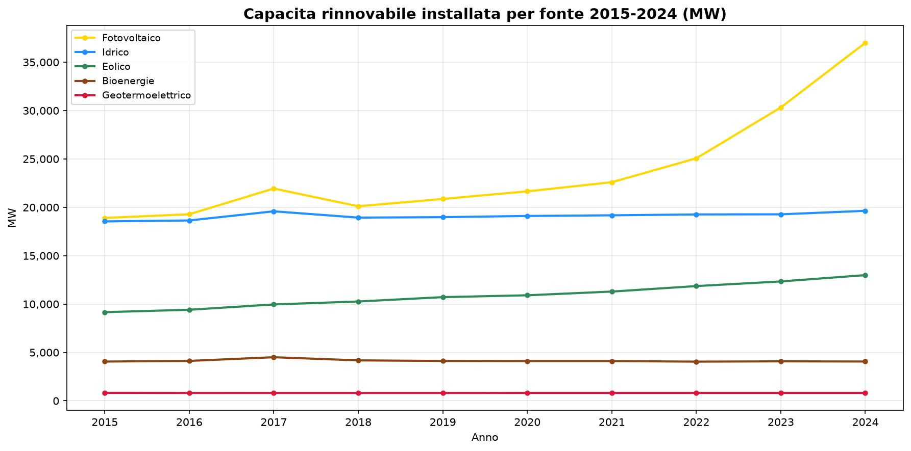
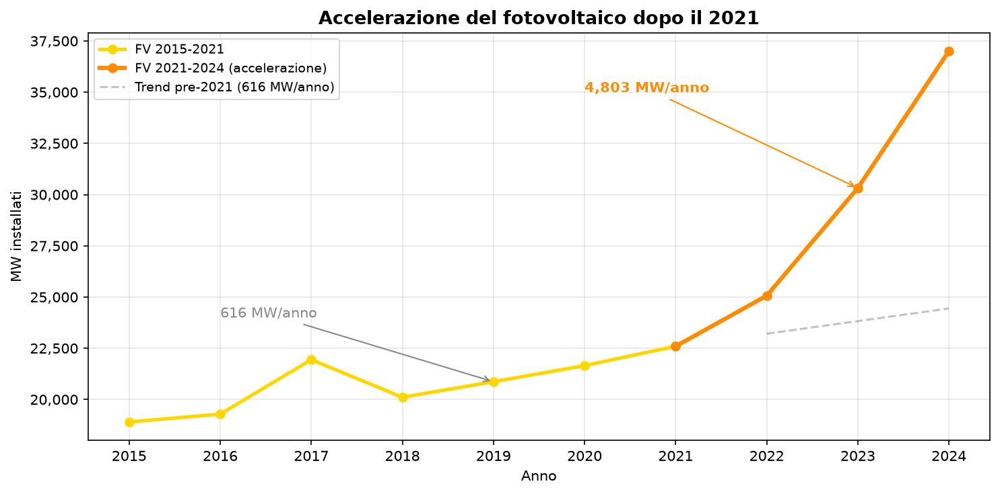
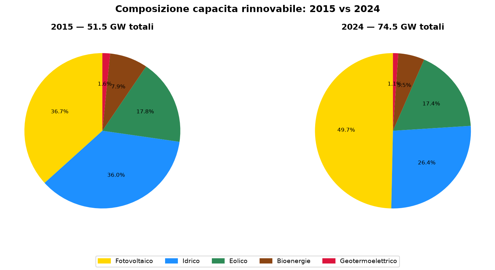

# Terna capacità rinnovabile 2015-2024 — il fotovoltaico raddoppia

**In 10 anni la capacità rinnovabile installata in Italia è passata da 51,5 GW a 74,5 GW (+45%). Il fotovoltaico guida la corsa: da 18,9 GW a 37,0 GW (+96%), con un'accelerazione netta dopo il 2021. L'eolico cresce del 42%, l'idrico resta sostanzialmente stabile.**

> Capacità rinnovabile totale 2024: **74,5 GW** (era 51,5 GW nel 2015)
> Fotovoltaico: **37,0 GW** (+96%)
> Eolico: **13,0 GW** (+42%)
> Idrico: **19,6 GW** (+6%)
> Accelerazione FV post-2021: **8× più veloce** (da 615 a 4.803 MW/anno)

---

## 1. Il trend decennale

| Anno | Fotovoltaico | Idrico | Eolico | Bioenergie | Geotermico | **Totale** |
|------|-------------|--------|--------|-----------|-----------|-----------|
| 2015 | 18.901 | 18.543 | 9.162 | 4.057 | 821 | **51.484** |
| 2016 | 19.283 | 18.641 | 9.410 | 4.124 | 815 | **52.273** |
| 2017 | 21.940 | 19.586 | 9.960 | 4.505 | 813 | **56.804** |
| 2018 | 20.108 | 18.936 | 10.265 | 4.180 | 813 | **54.302** |
| 2019 | 20.865 | 18.982 | 10.715 | 4.120 | 813 | **55.495** |
| 2020 | 21.650 | 19.106 | 10.907 | 4.106 | 817 | **56.586** |
| 2021 | 22.594 | 19.172 | 11.290 | 4.106 | 817 | **57.979** |
| 2022 | 25.064 | 19.265 | 11.858 | 4.049 | 817 | **61.053** |
| 2023 | 30.319 | 19.274 | 12.336 | 4.079 | 817 | **66.825** |
| 2024 | 37.002 | 19.637 | 12.990 | 4.062 | 817 | **74.508** |

*Capacità lorda installata in MW. Fonte: Terna S.p.A.*

*Capacità installata lorda per fonte (MW). Il fotovoltaico domina la crescita, l'idrico è stabile, l'eolico cresce moderatamente.*

---

## 2. L'accelerazione del fotovoltaico

La storia più importante è l'accelerazione del fotovoltaico dopo il 2021:

| Periodo | Incremento totale | Media annua |
|---------|------------------|-------------|
| 2015-2021 | +3.693 MW | **615 MW/anno** |
| 2021-2024 | +14.408 MW | **4.803 MW/anno** |

**Fattore di accelerazione: 8×.**

Questa accelerazione coincide con il recepimento della direttiva RED II (D.Lgs 199/2021) e con l'effetto combinato di incentivi (Superbonus, DM FER) e calo del costo dei pannelli. La capacità installata nei 3 anni post-2021 è quasi 4 volte quella dei 6 anni precedenti.

Se il trend pre-2021 fosse continuato, oggi avremmo circa 25 GW di FV — 12 GW in meno della realtà.

*Confronto tra trend pre-2021 e crescita effettiva. La linea tratteggiata mostra l'estrapolazione del trend 2015-2021.*

---

## 3. La composizione del mix di capacità

| Fonte | 2015 (MW) | Quota 2015 | 2024 (MW) | Quota 2024 | Variazione |
|-------|-----------|-----------|-----------|-----------|-----------|
| Fotovoltaico | 18.901 | 36,7% | 37.002 | 49,7% | +96% |
| Idrico | 18.543 | 36,0% | 19.637 | 26,4% | +6% |
| Eolico | 9.162 | 17,8% | 12.990 | 17,4% | +42% |
| Bioenergie | 4.057 | 7,9% | 4.062 | 5,5% | +0% |
| Geotermico | 821 | 1,6% | 817 | 1,1% | -0% |

Il fotovoltaico passa dal 36,7% al **49,7%** del totale — praticamente metà della capacità rinnovabile nazionale è solare.

*Il fotovoltaico passa da poco più di un terzo a metà della capacità installata. Idrico ed eolico perdono peso relativo pur crescendo in valore assoluto.*

---

## 4. Dove si installa

### Fotovoltaico — top 5 regioni 2024
| Regione | MW |
|---------|-----|
| Lombardia | 4.959 |
| Veneto | 3.748 |
| Puglia | 3.627 |
| Emilia-Romagna | 3.574 |
| Lazio | 3.295 |

Il fotovoltaico è diffuso su tutto il territorio — le prime 5 regioni coprono il 51% della capacità nazionale. A differenza dell'eolico, non c'è un forte divario Nord-Sud: Lombardia e Veneto guidano per numero di impianti, Puglia per potenza media.

### Eolico — top 5 regioni 2024
| Regione | MW |
|---------|-----|
| Puglia | 3.235 |
| Sicilia | 2.490 |
| Campania | 2.177 |
| Basilicata | 1.505 |
| Calabria | 1.249 |

L'eolico è concentrato al Sud: le prime 5 regioni (tutte meridionali) coprono l'84% della capacità eolica nazionale.

---

## Cosa abbiamo imparato

1. **La capacità rinnovabile cresce del 45% in 10 anni**: da 51,5 a 74,5 GW.
2. **Il fotovoltaico raddoppia** (+96%) e oggi vale metà della capacità rinnovabile nazionale.
3. **L'accelerazione post-2021 è netta**: la crescita del FV è 8× più veloce rispetto al periodo 2015-2021.
4. **L'eolico cresce ma senza accelerazione**: +42% in 10 anni, ritmo costante.
5. **Idrico, bioenergie e geotermico sono stabili**: non c'è nuovo potenziale significativo.

### Perché è importante

Questi dati sulla capacità installata sono il **denominatore giusto** per leggere la produzione elettrica (dataset `terna_electricity_by_source`). Incrociando capacità e produzione si può separare l'effetto "nuovi impianti" dall'effetto "meteo" (siccità, ventosità). È il prossimo passo naturale.

---

## Dataset

- **Fonte**: Terna S.p.A. — [dati.terna.it](https://dati.terna.it)
- **Copertura**: 2015-2024 (10 anni), nazionale + regionale + provinciale
- **Metrica**: capacità installata lorda in MW per fonte
- **Dataset in clean-query**: `terna_capacita_rinnovabile`

### Limiti

- I dati di capacità lorda non distinguono tra impianti nuovi e repowering
- Non è incluso l'accumulo a batterie (la capacità di accumulo è tracciata separatamente da Terna)
- I dati 2017 sono regolari per la capacità (a differenza del dataset di produzione)

---

## Notebook

- `notebooks/terna_capacita_v1.ipynb` — analisi 2015-2024, trend e figure

## Contratto tecnico

[candidates/terna-capacita-rinnovabile](https://github.com/dataciviclab/dataset-incubator/tree/main/candidates/terna-capacita-rinnovabile)
