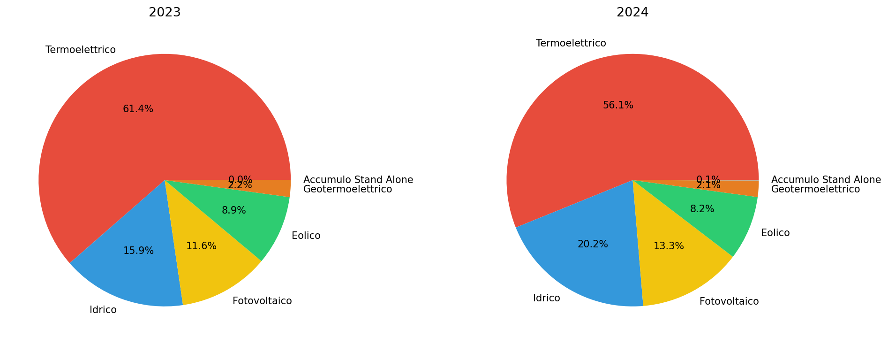
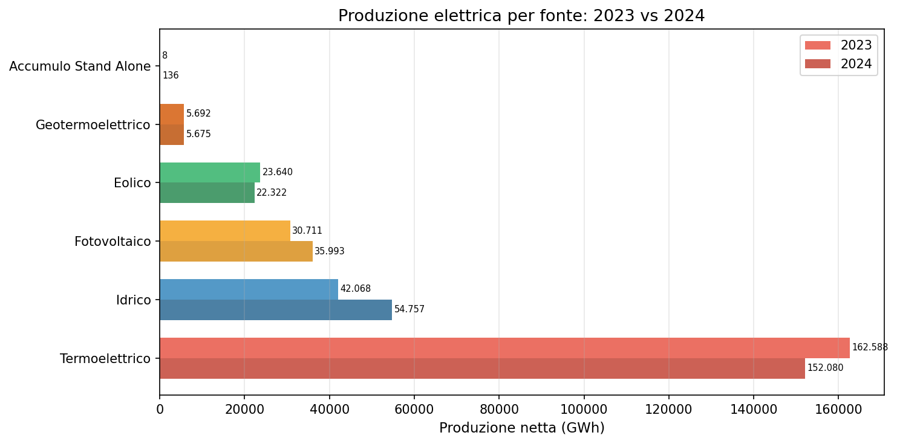

# Terna mix elettrico 2023-2024 — le rinnovabili sfiorano il 44%

**In un anno la quota di elettricità da fonti rinnovabili è passata dal 38,6% al 43,9%. Il termoelettrico ha perso 10.508 GWh mentre fotovoltaico e idrico ne hanno guadagnati 18.000. L'Italia si avvicina alla metà della produzione elettrica da fonti pulite.**

Il 2023 era stato un anno di siccità (idrico in sofferenza). Il 2024 ha recuperato, con l'idrico che ha prodotto 54.757 GWh contro i 42.068 del 2023 (+30%). Il fotovoltaico ha aggiunto 5.282 GWh (+17%). Il termoelettrico ha perso quota, scendendo da 162.588 a 152.080 GWh.

> Produzione netta 2024: **270.963 GWh**.
> Quota rinnovabili: **43,9%** (era 38,6% nel 2023).
> Fossili in calo: **-10.508 GWh** (-6,5%).

---

## 1. Il mix nazionale

| Fonte | 2023 (GWh) | 2024 (GWh) | Variazione |
|-------|-----------|-----------|-----------|
| Termoelettrico | 162.588 | 152.080 | -10.508 (-6,5%) |
| Idrico | 42.068 | 54.757 | +12.689 (+30,2%) |
| Fotovoltaico | 30.711 | 35.993 | +5.282 (+17,2%) |
| Eolico | 23.640 | 22.322 | -1.318 (-5,6%) |
| Geotermoelettrico | 5.692 | 5.675 | -17 (-0,3%) |
| Accumulo Stand Alone | 8 | 136 | +128 |
| **Totale** | **264.708** | **270.963** | **+6.255 (+2,4%)** |

Il calo del termoelettrico (-10.508 GWh) è stato compensato dalla crescita combinata di idrico e fotovoltaico (+17.971 GWh). L'eolico, al contrario, ha perso il 5,6% della produzione.

## 2. Il bilancio rinnovabili vs fossili

| Anno | Termoelettrico | Rinnovabili | Quota rinnovabili |
|------|---------------|------------|-------------------|
| 2023 | 162.588 GWh | 102.119 GWh | 38,6% |
| 2024 | 152.080 GWh | 118.883 GWh | 43,9% |

In un anno solo, la quota rinnovabili ha guadagnato 5,3 punti percentuali. Al ritmo del 2024, l'Italia supererebbe il 50% di rinnovabili entro il 2026. Ma il 2023 era stato un anno secco — quindi il confronto è falsato dal recupero idrico del 2024.

---

## Cosa abbiamo imparato

### I fatti

1. **Le rinnovabili hanno guadagnato 5,3 punti percentuali** in un anno: dal 38,6% al 43,9%.
2. **Il termoelettrico si è contratto del 6,5%** (-10.508 GWh), il calo più netto tra tutte le fonti.
3. **Idrico e fotovoltaico hanno guidato la crescita**: +12.689 e +5.282 GWh rispettivamente.
4. **L'eolico è l'unica rinnovabile in calo** (-5,6%), con 1.318 GWh in meno.
5. **Il 2024 non è un anno normale**: il recupero idrico dopo la siccità del 2023 amplifica la crescita delle rinnovabili.

### E allora?

C'è un effetto climatico (siccità 2023 → idroelettrico 2024) che gonfia i numeri. E c'è un effetto strutturale (nuova capacità fotovoltaica installata). Separare i due è difficile con soli due anni di dati. La domanda che resta: **quanto della crescita delle rinnovabili è strutturale e quanto è un rimbalzo meteorologico?**

---

## Dataset

- **Fonte**: Terna S.p.A.
- **Copertura temporale**: 2023-2024
- **Copertura**: nazionale + regionale + provinciale, per tipo produzione e fonte
- **Dataset in clean-query**: `terna_electricity_by_source`

### Limiti

- Solo 2 anni di dati disponibili — non consente ancora una lettura di trend pluriennale
- I dati non separano gli effetti climatici (siccità, vento) dalla nuova capacità installata
- I totali Lorda e Netta coincidono nel dataset attuale (probabilmente già aggregati a monte)

---

## Notebook

- `notebooks/terna_electricity_v2.ipynb` — validazione dati, genera figure in `figures/`

## Contratto tecnico

[candidates/terna-electricity-by-source](https://github.com/dataciviclab/dataset-incubator/tree/main/candidates/terna-electricity-by-source)
