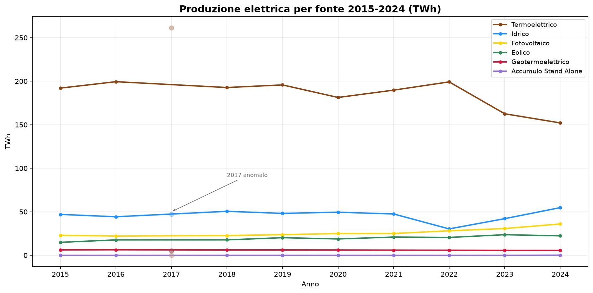
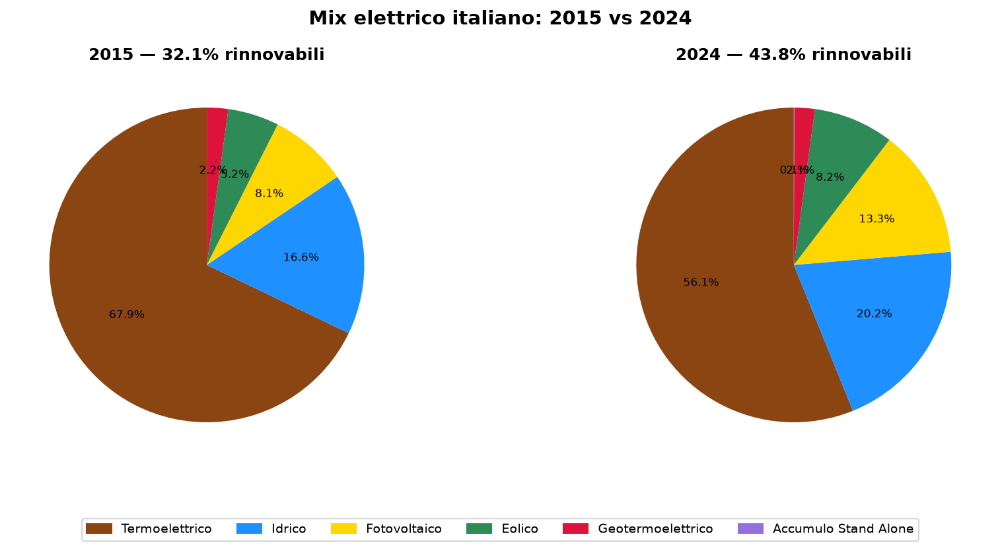
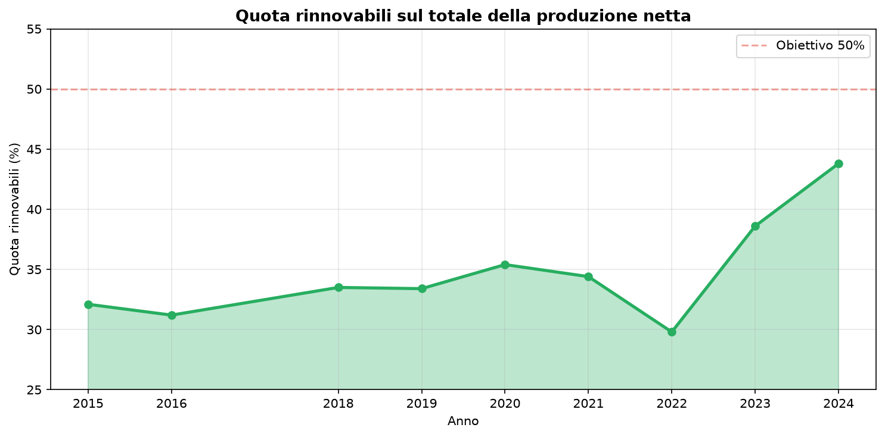

# Terna mix elettrico 2015-2024 — le rinnovabili salgono dal 32% al 44%

**In 10 anni la quota di elettricità da fonti rinnovabili in Italia è passata dal 32,1% al 43,8%. Il termoelettrico ha perso 40.000 GWh (-21%), il fotovoltaico è quasi raddoppiato (+57%) e l'eolico è cresciuto del 50%. La produzione totale scende da 283 a 271 TWh (-4,3%).**

Tra il 2015 e il 2024 il mix elettrico italiano è cambiato in modo strutturale e misurabile. Il termoelettrico — che nel 2015 valeva il 68% della produzione — scende al 56%. Il fotovoltaico raddoppia la sua produzione. L'idroelettrico oscilla violentemente per via del clima, ma resta la seconda fonte rinnovabile per volume.

> Produzione netta 2024: **271 TWh** (era 283 TWh nel 2015)
> Quota rinnovabili: **43,8%** (era 32,1%, **+11,7 punti**)
> Termoelettrico in calo: **-40.000 GWh** (-21%)
> Fotovoltaico: **+13.051 GWh** (+57%)
> Eolico: **+7.478 GWh** (+50%)

---

## 1. Il trend decennale

| Anno | Termoelettrico | Idrico | Fotovoltaico | Eolico | Geotermico | **Totale** | *Rinnovabili* | *Quota* |
|------|---------------|--------|-------------|--------|-----------|-----------|--------------|---------|
| 2015 | 192.054 | 46.969 | 22.942 | 14.844 | 6.185 | **282.994** | *90.940* | *32,1%* |
| 2016 | 199.430 | 44.257 | 22.104 | 17.689 | 6.289 | **289.768** | *90.339* | *31,2%* |
| 2018 | 192.730 | 50.503 | 22.654 | 17.716 | 6.105 | **289.708** | *96.978* | *33,5%* |
| 2019 | 195.734 | 48.154 | 23.689 | 20.202 | 6.075 | **293.853** | *98.120* | *33,4%* |
| 2020 | 181.307 | 49.495 | 24.942 | 18.762 | 6.026 | **280.531** | *99.225* | *35,4%* |
| 2021 | 189.711 | 47.478 | 25.039 | 20.927 | 5.914 | **289.070** | *99.358* | *34,4%* |
| 2022 | 199.210 | 30.291 | 28.121 | 20.494 | 5.837 | **283.953** | *84.743* | *29,8%* |
| 2023 | 162.588 | 42.068 | 30.711 | 23.640 | 5.692 | **264.708** | *102.119* | *38,6%* |
| 2024 | 152.080 | 54.757 | 35.993 | 22.322 | 5.675 | **270.963** | *118.747* | *43,8%* |

*Produzione netta in GWh. Le rinnovabili includono idrico, fotovoltaico, eolico e geotermoelettrico. Accumulo Stand Alone (batterie) è escluso perché non è una fonte di produzione. 2017 escluso per anomalie nei dati (vedi caveat).*

*Produzione netta annua per fonte (TWh). Il termoelettrico scende strutturalmente, il fotovoltaico cresce in modo costante. L'idrico è la variabile climatica dominante. I punti semitrasparenti sul 2017 mostrano i valori anomali, esclusi dal trend.*

---

## 2. I cinque fatti chiave

### 2.1 Il termoelettrico cala, ma resta dominante

Nel 2024 il termoelettrico produce **152.080 GWh**, il minimo del decennio, ma vale ancora il **56%** del mix. In 10 anni ha perso 40.000 GWh (-21%). Il calo non è lineare: negli anni di siccità (2022) il fossile è tornato a crescere (+9%), perché ha compensato il crollo dell'idroelettrico. Il termoelettrico è il *balancer* del sistema: cala quando le rinnovabili bastano, sale quando mancano.

### 2.2 Il fotovoltaico è la forza della transizione

Il fotovoltaico passa da **22.942 a 35.993 GWh** (+57%). È l'unica fonte con crescita **costante anno su anno**, senza inversioni. L'accelerazione post-2021 è netta: da +350 GWh/anno (2015-2021) a +3.650 GWh/anno (2021-2024) — **dieci volte più veloce**. Coincide con il recepimento della direttiva RED II (D.Lgs 199/2021).

### 2.3 L'idrico è la variabile climatica

L'idroelettrico oscilla da **30.291 GWh** (2022, siccità estrema) a **54.757 GWh** (2024, recupero). Un range di **24.466 GWh** — più dell'intera produzione eolica annua. Questa volatilità spiega metà del balzo delle rinnovabili nel 2024: non è solo nuova capacità, è anche più acqua.

**Morale**: un buon anno idrico non va confuso con un'accelerazione strutturale della transizione.

### 2.4 L'eolico cresce, senza balzi

L'eolico sale da **14.844 a 22.322 GWh** (+50%), con una crescita costante (~750 GWh/anno) ma senza l'accelerazione del fotovoltaico. Autorizzazioni complesse, contenzioso locale e limiti di rete frenano un decollo che i dati non mostrano ancora.

### 2.5 La produzione totale cala

La produzione netta totale scende da **283 a 271 TWh** (-4,3%). In un paese con PIL in crescita, è un segnale che efficienza energetica e generazione distribuita potrebbero stare riducendo il prelievo dalla rete — ma servono dati su domanda e autoconsumo per confermarlo.

*Confronto della composizione del mix: 2015 (32% rinnovabili) vs 2024 (44%). Il termoelettrico perde 12 punti, fotovoltaico ed eolico raddoppiano il loro peso.*

---

## 3. Bilancio rinnovabili vs fossili

| Anno | Termoelettrico | Rinnovabili | Altro¹ | Quota rinnovabili |
|------|---------------|-------------|--------|-------------------|
| 2015 | 192.054 | 90.940 | — | 32,1% |
| 2016 | 199.430 | 90.339 | — | 31,2% |
| 2018 | 192.730 | 96.978 | — | 33,5% |
| 2019 | 195.734 | 98.120 | — | 33,4% |
| 2020 | 181.307 | 99.225 | — | 35,4% |
| 2021 | 189.711 | 99.358 | — | 34,4% |
| 2022 | 199.210 | 84.743 | — | 29,8% |
| 2023 | 162.588 | 102.119 | 8 | 38,6% |
| 2024 | 152.080 | 118.747 | 136 | 43,8% |

¹ Accumulo Stand Alone (batterie). Presente dal 2023, marginale ma in rapida crescita.

*Quota rinnovabili sul totale della produzione netta. La linea tratteggiata marca l'obiettivo del 50%. Al ritmo medio di +1,3 pp/anno, il traguardo sarebbe raggiungibile intorno al 2028-2029.*

---

## Cosa abbiamo imparato

1. **Le rinnovabili guadagnano 11,7 punti in 10 anni**: dal 32,1% al 43,8%.
2. **Il termoelettrico cala del 21%** (-40.000 GWh), ma resta al 56% del mix.
3. **Il fotovoltaico è l'unica fonte in crescita costante**: +57%, con accelerazione netta post-2021.
4. **L'idrico oscilla di 24.466 GWh** tra anno secco e anno piovoso — più dell'intero eolico.
5. **L'eolico cresce del 50%** ma senza l'accelerazione del fotovoltaico.
6. **La produzione totale cala del 4,3%**: possibile effetto di efficienza energetica e generazione distribuita, da confermare con dati su domanda.

### La domanda che resta

**Quanto della crescita delle rinnovabili è strutturale e quanto è meteorologico?** Il fotovoltaico cresce indipendentemente dal clima. L'idrico no. Separare i due effetti significa incrociare produzione e capacità installata — il dataset `terna_capacita_rinnovabile` è il prossimo step naturale.

---

## Dataset

- **Fonte**: Terna S.p.A. — [dati.terna.it](https://dati.terna.it)
- **Copertura**: 2015-2024 (10 anni), nazionale + regionale + provinciale
- **Metrica**: produzione netta in GWh per tipo produzione e fonte
- **Dataset in clean-query**: `terna_electricity_by_source`

### Limiti

- **2017 escluso**: i dati mostrano valori anomali (termoelettrico 261.328 GWh, fotovoltaico 193 GWh, eolico 4.861 GWh) — probabile cambio metodologico nelle rilevazioni Terna.
- **Effetto clima non separato**: l'oscillazione idrica non consente di isolare la crescita strutturale da quella meteorologica.
- **Lorda e Netta coincidono**: nel dataset i totali per tipo sono identici — non è possibile distinguere autoconsumo.
- **Batterie ancora marginali**: l'accumulo stand alone compare dal 2023 (<0,1% del mix), ma cresce rapidamente.

---

## Notebook

- `notebooks/terna_electricity_v3.ipynb` — analisi 2015-2024, validazione e generazione figure
- `notebooks/terna_electricity_v2.ipynb` — analisi precedente (2023-2024)

## Contratto tecnico

[candidates/terna-electricity-by-source](https://github.com/dataciviclab/dataset-incubator/tree/main/candidates/terna-electricity-by-source)
